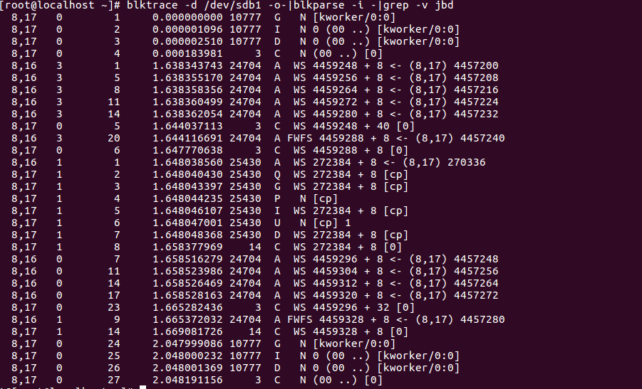

# blktrace
debugfs是ext2, ext3, ext4文件系统提供的文件系统访问工具，通过它我们可以不通过mount文件系统而直接访问文件系统的内容，它是e2fsprogs的一部分，默认应该都是安装的，详细的说明可以通过man debugfs得到。
## 基本使用



-    第一个字段：8,16 这个字段是设备号 major device ID和minor device ID。
-    第二个字段：3 表示CPU
-    第三个字段：1 序列号
-    第四个字段：0.000001096 Time Stamp是时间偏移
-    第五个字段：PID 本次IO对应的进程ID
-    第六个字段：Event，这个字段非常重要，反映了IO进行到了那一步
-    第七个字段：R表示 Read， W是Write，D表示block，B表示Barrier Operation,S表示sync
其中第六个字段非常有用：每一个字母都代表了IO请求所经历的某个阶段。
```
Q – 即将生成IO请求
|
G – IO请求生成
|
I – IO请求进入IO Scheduler队列
|
D – IO请求进入driver
|
C – IO请求执行完毕
```
-    第八个字段：272384+56，表示的是起始扇区号和扇区数目，即我们常说的Offset 和 Size,其中`<-`表示磁盘块设备和分区块设备的换算关系
```
8,16   1        9     1.665372032 24704  A FWFS 4459328 + 8 <- (8,17) 4457280
```
8-16是/dev/sdb,8-17是/dev/sdb1,sdb1的偏移是常见的2048 sectors,`4459328-4457280=2048`
-    第九个字段： 进程名

## 场景
### IO延时
### 关联扇区和文件
那么如何由扇区号推导出inode，再由inode推导出其所指向的文件呢？
```
8,17   1        2     1.648040430 25430  Q  WS 272384 + 8 [cp]
8,17   1        3     1.648043397 25430  G  WS 272384 + 8 [cp]
```
我们通过使用sync的方式mount分区，这样能够及时得到IO情况.上面的日志告诉我们进程是`cp`,扇区偏移是272384,长度是8个扇区(一个block);
通过debugfs的icheck命令通过分区内的block号可以找到文件的inode号.
```
icheck block ...
       Print a listing of the inodes which use the one or more blocks specified on the command line.
```
block是分区内的block偏移，而blktrace中抓取的是每个块设备的sector,所以需要做转换`(扇区号-分区开始扇区号)/(block size/sector size)`，这里就是`(272384-2048)/8=556899`
```
debugfs /dev/sdb1
debugfs:  icheck 33792
Block	Inode number
33792	13
debugfs:  ncheck 13
Inode	Pathname
13	//initial-setup-ks.cfg
debugfs:  block_dump 33792
0000  2376 6572 7369 6f6e 3d44 4556 454c 0a23  #version=DEVEL.#
0020  2058 2057 696e 646f 7720 5379 7374 656d   X Window System
...
cat initial-setup-ks.cfg
#version=DEVEL
# X Window System configuration information
xconfig  --startxonboot
...
debugfs:  stat initial-setup-ks.cfg
Inode: 13   Type: regular    Mode:  0644   Flags: 0x80000
Generation: 7190620    Version: 0x00000000:00000001
User:     0   Group:     0   Size: 1760
File ACL: 0    Directory ACL: 0
Links: 1   Blockcount: 8
Fragment:  Address: 0    Number: 0    Size: 0
 ctime: 0x5cee7a43:ad359260 -- Wed May 29 20:25:39 2019
 atime: 0x5cee7a43:a7b9c520 -- Wed May 29 20:25:39 2019
 mtime: 0x5cee7a43:ad359260 -- Wed May 29 20:25:39 2019
crtime: 0x5cee7a43:a7b9c520 -- Wed May 29 20:25:39 2019
Size of extra inode fields: 28
Extended attributes stored in inode body:
  selinux = "unconfined_u:object_r:unlabeled_t:s0\000" (37)
EXTENTS:
(0):33792
```
