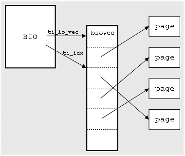

# 通过hijack了解bio
## 背景
bio是block io,它是一个描述硬盘里面的位置与page cache的页对应关系的数据结构，每个bio对应的
硬盘里面一块连续的位置，每一块硬盘里面连续的位置，可能对应着page cache的多页，或者一页，
所以它里面会有一个`bio_vec *bi_io_vec`的表。
而每个bio_vec都只能描述一个页内数据的连续的数据的偏移和长度:

通过bi_sectors和bi_size来描述硬盘中起始位置和长度。
一个bio的处理:一个bio通常通过`submit_bio`来提交给设备队列，下面会经过bio聚合，转化成request,磁盘调度队列，块设备驱动，磁盘处理，对于bio来说大部分都是异步，所以处理结束通过`bio->bi_end_io`来作为callback获取结果,外部的接口使用bio_endio。同步的读写是通过等待callback事件到来从而完成同步读写。
## 目标
进行块设备加密，磁盘落盘的数据是密文，而对于文件系统来说是明文.加密算法因为用过sm4，所以就选用了最简单的`sm4(ecb)`加解密。
### 设计
submit_bio是写IO的起手势,所以通过hook submit_bio来进行写加密，保证提交给下面的数据是经过加密的就好了。而对于读IO可以通过在IO完成之后通知给文件系统之前进行解密，可以hook bio_endio来进行数据解密，确保page cache上的数据是经过解密后的明文。
### 写加密
bio只是管理的数据结构，数据仍然是存放在page cache中的，最终的结果要求是page cache中的所述句仍然是明文，提交给磁盘的数据是密文，所以一块数据是搞不定这件事了，我们需要重新申请一块内存来存放密文数据。
#### bio拷贝
#### 数据加密
### 读解密
相对于写操作，读IO就比较简单了，从磁盘中读取到了密文数据到page cache中，我们只需要在文件系统看到这块page cache前解密就好，不需要倒腾内存，只需要原地解密。

遍历bio指向的内存数据:
### 后续改进
因为加解密完全使用cpu来进行，速度肯定比较慢，最终的结果就是IO速率大幅度下降.

一个选择就是使用有硬件加密卡支持的算法，提升速率;

另外一个选择就是启动一个线程，先将bio缓存下来慢慢加解密，为了提升体验，可以提升读IO的优先级，让用户优先看到数据，至于写放在后台慢慢整吧。

## 参考
>https://lwn.net/Articles/26404/
>www.eeworld.com.cn/mp/ymc/a52704.jspx
