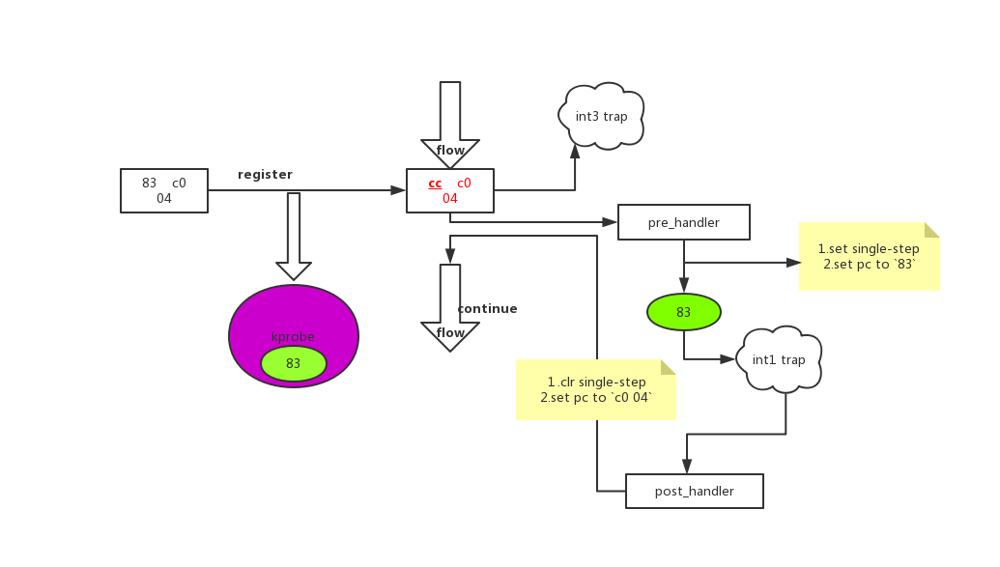
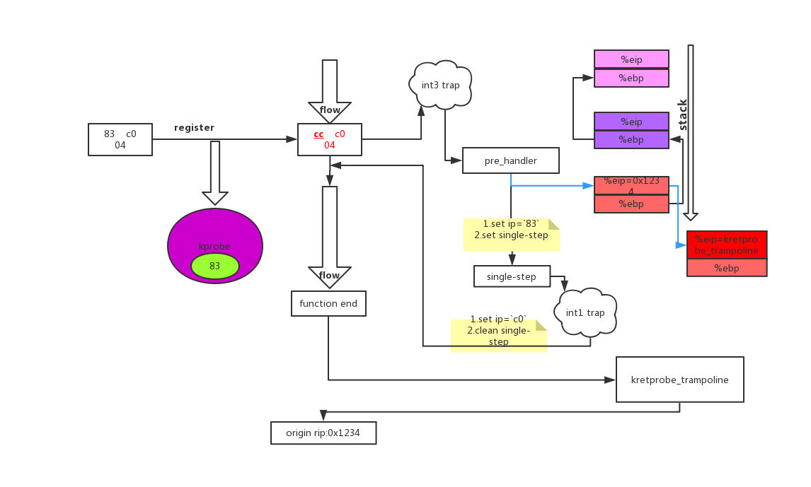
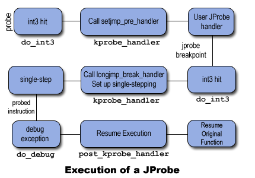

# linux kprobes
kprobes出现了非常长的时间,最早是2.6.9版本中，最早能够追溯到2004年，距离现在15年，一直没有为人所知，但却是隐藏在诸多技术后的一个基础组件，例如ftrace,最近非常火热的ebpf.
kprobe是什么?它是kernel probes(我翻译成探针)，是一种debug机制，它是由IBM开发的,最初计划用来和另外一个工具DProbes配套使用的，只是只有kprobe被合并到mainline了。但是kprobes使用起来有些复杂，还需要单独编写module,所以kprobe为了存活只能不停的寻找和他能够配合的，后来和ftrace勾搭上了，现在还和ebpf眉来眼去。

kprobes通常被用来查找性能瓶颈，记录指定的事件，用来trace,它理论上能够监视任何的事件，但是有一点:它实现不了gdb的watch功能。目前它主要作为ftrace,ebpf,SystemTap等框架和工具的后端存在，主要用来做日志了，看起来它也混的挺憋屈的，有强大的功能就是没人用。它主要有三类:kprobe,kretprobe,jprobe,对外称为kprobes,最后好多人都弄混了kprobes/kprobe。不过哥三各有用途，kprobe作为最常用的，可能就是记录日志,而jprobe类似于kprobe的pre_handler,但是有个优点，不需要从寄存器中提取各种参数，直接就定义它的类型和原始函数的参数一致就可以直接使用了，而kretprobe可以查看这个函数执行结束后参数的变化，和kprobe一个在函数开始，一个在函数结束。而最新的内核中jprobe因为它的优势不明显已经被干掉了，由此可见哪里都有竞争，就是代码也得证明它能干别人干不了的事情并且干得很好，没有代码是永生的，历史的车轮过后就是无人问津的垃圾代码，就算你合并到mainline中也不是高枕无忧。

kprobe可以插入到任何指令位置(除了黑名单函数之外)，jprobe只能放到函数开始处,kretprobe只会在函数结束的时候才会执行。

|      |插入位置| 用途 |
|------|-------|-----|
|kprobe|函数的任何位置(除了黑名单函数之外)|记录日志|
|jprobe|放到函数开始|查看传入参数|
|kretprobe|函数结束|查看返回参数|

## 原理
下面将会尝试从一个概括的角度看一个probe怎么工作的，介绍
一个probe代表一个断点和断点触发后所要调用的函数。

当同一个位置注册有多个kprobe时，会将kprobe的回调以链表形式组织起来，逐个调用处理。
当注册不同位置的kprobe时，以hashtable的形式组织起来。

### kprobe
一个kprobe点可以有pre_handler和post_handler，分别在指令执行前和执行后被调用，我们可以通过保存的寄存器还原出在原始函数中代表的参数，在函数入口处还比较容易，如果在函数中间插入一个kprobe，要还原出有意义的参数内容需要对汇编部分有较深的了解。

先从一个图整体看它是如何工作的:

1.系统初始化的时候会注册中断处理，在x86上会有两个int1和int3,处理方法分别是do_debug和do_int3,这是kprobe在x86上实现的基石。
2.注册一个kprobe到指定指令位置，它会生成一个kprobe对象，做一些保存工作:
1.保存1 byte指令信息到kprobe
2.替换指令为0xcc
3.当该位置的指令执行的时候，触发了int3,之后就会找到该位置信息对应的kprobe,执行pre_handler,之后设置成single_step[gdb中的单步执行]，执行原始的指令，执行一条指令后触发了int1,之后也是找到对应的kprobe,执行post_handler

### kretprobe
先看一个比较低效的图，这种方式只是早期实现的，应该从OPTPROBES之后在x86上已经被优化实现了:

kretprobe仍然是利用kprobe机制，用户可以定义一个entry_handler和一个handler,其中entry_handler会在函数入口处被调用，而handler会在函数退出的时候被调用。
kretprobe会注册成一个只有pre-handler的kprobe，pre-handler是由kretprobe自定实现的pre_handler_kretprobe,它会负责大部分的工作。

1.注册成一个kprobe,当执行流触发int3 trap时，会执行他的pre-handler:pre_handler_kretprobe,执行entry_handler,保存真实的函数返回地址，替换函数返回地址为kretprobe_trampoline，这样函数返回的时候先返回我们的trampoline，之后才由trampoline返回到原始的caller.

2.之后经过single-step过程，继续回到原始的callee处执行

3.当callee返回时，kretprobe_trampoline会找到真实的返回地址设置回来，这样在从寄存器恢复之后就能恢复到正常过程。调用用户定义的handler,之后就可以恢复寄存器
但是实际上这种方式已经被优化掉了，看下面经过kprobe优化过的kretprobe.

### kprobe优化

### Jprobe



jprobe仍然是使用的kprobe的机制，但是这个过程相对来说就比较绕了。

首先jprobe要求用户定义和需要probe相同的原型函数，这样就不需要分析寄存器就能简单地获取到可读参数的内容。

jprobe中对参数的操作不会对原始函数传入的参数造成影响，它所做的操作都是基于原始参数的一份拷贝上，但是它只是一个浅拷贝，仍然可以操作参数指针所指向的内存区域。

jprobe没有要求用户定义pre-handler而是自己定义了一个pre-handler:setjmp_pre_handler和另外一个break_heandler:longjmp_break_handler.

jprobe的过程可以简单划分成这三个阶段:

1.在函数起始地址处进行kprobe的指令替换，执行到这的时候会触发int3,之后就是do_int3->kprobe_int3_handler->setjmp_pre_handler,它保存栈的内容和寄存器内容，之后设置rip=用户定义的handler,最终pre-handler返回1,这就不会设置single-step模式。在返回之后根据eip的地址执行到用户定义的handler,因为栈的排布和寄存器内容都是完全相同的(除了rip),这样就完全可以访问原始函数的参数。当用户定义的函数结束后需要通过`jprobe_return`的方式返回而不是通常的`ret`.

2.在上面`jprobe_return`中，它将栈恢复到原始函数的那一帧(更改rsp)，将拷贝的栈帧扔掉，之后主动`int3`再次陷入异常，kprobe_int3_handler发现断点地址是用户定义的函数地址，并没有对应的注册的probe,但是当前cpu的kprobe正在激活状态，它把这种状态认为是Jprobe产生的，之后调用当前cpu kprobe的break_handler:longjmp_break_handler,它会恢复栈和寄存器的内容

3.典型的设置single-step模式执行被替换的指令，之后陷入int1,清除该模式,恢复到原始的执行流
## kprobe的优化
通过上面的看到，每次都要经过int trap过程，这个过程比较耗时，所以有了优化的kprobe,会优化成jmp指令跳转到kprobe处理处，但是不是所有的位置都可以优化成这种形式。
1.安全检查
因为`jmp + 偏移`的方式，目前偏移为32bit,所以共占据5个字节，可能会占据原来多条指令的位置，也有可能截断原来的指令。
同时，不能有跳转到这块要被覆盖区域的指令,指令都已经换了，再jmp过来可能重复跳转到kprobe处理，也有可能遭遇指令异常:
1.这个函数不能包含非直接跳转
2.函数不能包含有触发异常的指令，例如0xcc，另外也不能有访问异常表的地址
3.没有近跳转到被优化区域的指令
4.被优化区域的每条指令都可以单独执行
优化准备:
kprobe准备一个detour的buffer,里面要包含如下功能的指令:
- 能够将cpu寄存器压栈(模拟int3的trap过程)
- 调用trampoline的函数，完成原始的kprobe逻辑过程，调用用户定义的handler
- 恢复寄存器
- 被优化区域的指令拷贝到buffer中
- 跳转回原始执行流的代码
如果kprobe注册时有下面的情况，也是不能优化的:
1.包含break_handler或者post_handler,例如jprobe中用户没有设置这两个handler,但是jprobe在以kprobe形式管理的时候它设置了break_handler,所以它是不能被优化的。
2.处于被优化区域内有其他的指令已经被probe了
3.这个probe处于disable的状态，就是没有激活
如果kprobe可以被优化，Kprobes会将kprobe加入到待优化链表，然后启动kprobe-optimizer工作队列来优化它。如果在优化前已经触发了trap,会通过设置rip到buffer中的指令，这样可以避免未优化时的single-step,也就是放弃这次的触发捕捉.
Kprobe-optimizer并不会立即插入jmp指令，而是先调用`synchronize_sched()`等待进入一个安全的上下文，因为很可能在执行待优化区域代码的过程中被中断。CONFIG_PREEMPT=n`synchronize_sched()`可以保证在它返回的时候所有的中断都是打开的,所以优化的前提就是只在CONFIG_PREEMPT=n配置的内核上。
之后会调用stop_machine()来用jmp指令来替代优化区域，将优化区域的代码拷贝到detour buffer.

恢复优化区域的代码:
当优化过的kprobe被注销,disable或者被其他的kprobe阻塞时，都会解除优化。如果优化还没有完成，只需要从待优化队列中删除就可以了。如果优化已经完成，需要使用`text_poke_smp()`来将原来的指令拷贝回来，并且第一个字节恢复成int3,就是恢复成未优化的状态。


(*)Please imagine that the 2nd instruction is interrupted and then
the optimizer replaces the 2nd instruction with the jump *address*
while the interrupt handler is running. When the interrupt
returns to original address, there is no valid instruction,
and it causes an unexpected result.

(**)This optimization-safety checking may be replaced with the
stop-machine method that ksplice uses for supporting a CONFIG_PREEMPT=y
kernel.

NOTE for geeks:
The jump optimization changes the kprobe's pre_handler behavior.
Without optimization, the pre_handler can change the kernel's execution
path by changing regs->ip and returning 1.  However, when the probe
is optimized, that modification is ignored.  Thus, if you want to
tweak the kernel's execution path, you need to suppress optimization,
using one of the following techniques:
- Specify an empty function for the kprobe's post_handler or break_handler.
 or
- Execute 'sysctl -w debug.kprobes_optimization=n'
## kprobes的注意事项
1.kprobe允许在同一地址注册多个kprobes，但是不能同时在该地址上有多个jprobes

2.如果注册了jprobe或者带有post_handler的kprobe,这个probe点是不会被转化成优化的probepoint

3.理论上用户可以在内核的任何位置注册探测点，设置可以在中断处理函数中注册探测点，但是也有一些例外的放。
如果用户尝试在实现kprobe的代码`(包括kernel/kprobes.c和arch/*/kernel/kprobes.c`以及`do_page_fault`和`notifier_call_chain`中注册探测点，`register_*probe`将返回`-EINVAL`.

4.gcc可能将一个函数隐式地优化成一个内联函数，此时向其上注册探测点，kprobe不会尝试注册，此时会注册失败，此时你可能需要检查`/proc/kallsyms或者System.map`。

5.一个探测点处理函数能够修改被探测函数的上下文，如修改内核数据结构，寄存器等。因此，kprobe可以用来热升级或进行一些错误注入。

6.如果一个探测处理函数调用了另一个探测点，该探测点的处理函数不将运行，但是它的nmissed数将加1。
多个探测点处理函数或同一处理函数的多个实例能够在不同的CPU上同时运行。

7.除了注册和卸载，kprobe不会使用mutexe或分配内存。

8.探测点处理函数在运行时是禁止抢占的，而且在不同的架构上，探测点处理函数运行时也可能是禁止中断的。因此，对于任何探测点处理函数，不要使用导致睡眠或进程调度的任何内核函数（如尝试获得semaphore)。

9.kretprobe是通过取代返回地址为预定义的trampoline的地址来实现的，因此栈回溯和gcc内嵌函数__builtin_return_address()调用将返回trampoline的地址而不是真正的被探测函数的返回地址。

10.如果一个函数的调用次数与它的返回次数不相同，那么在该函数上注册的kretprobe探测点可能产生无法预料的结果,如果你看到下面的错误提示，那就是kprobe出现了问题，检查所有kretprobe在每个cpu上的状态(在处理前和退出后会将kprobe保存到current_kprobe).
```
kretprobe BUG!: Processing kretprobe d000000000041aa8 @ c00000000004f48c
```
11.当进入或退出一个函数时，如果CPU正运行在一个非当前任务所有的栈上，那么该函数的kretprobe探测可能产生无法预料的结果，因此kprobe并不支持在x86_64上对__switch_to()的返回探测，如果用户对它注册探测点，注册函数将返回-EINVAL。

## reference

1.[An introduction to KProbes](https://lwn.net/Articles/132196/)  
2.Documentation/kprobes.txt  
3.[Kernel- and User- Probes in Linux: Magic?](https://dev.framing.life/tracing/kernel-and-user-probes-magic/)
