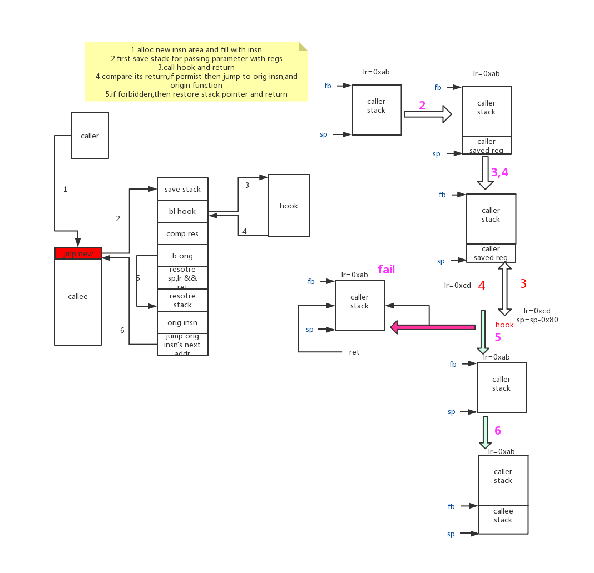
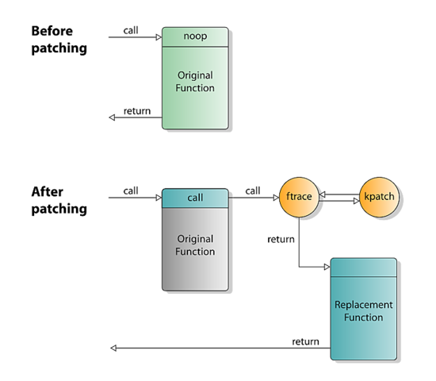

# linux内核态hook
linux内核支持动态加载module，今天不聊正常的module，只简单看一下实现Hook的module. hook通常翻译做劫持，不过这个翻译听起来让人不舒服，感觉有点恐怖，所以大家都是喊行话:`hook`.  
  
上图是经典的堆栈式hook,也是splice典型的做法，在原有的流程中插入hook，更加典型的做法是栈在调用过程中从`funcA->funcB`变成了`funcA->hook->funcB`  
  
这个做法和第一张图的做法是一致的，区别在于`hook function`调用完毕后栈恢复成了刚从`funcA`出来要到`funB`的样子，但是中间加了一点点代码，根据`hook`返回值判断是否应该拦截该过程，如果要拦截则直接返回错误值，如果允许则和`funcA->funcB`过程完全一样。  
## hook的实现思路
### 修改系统调用表指针
因为大部分需要监控的是来自用户程序产生的动作，所以可以在系统调用层次上想想办法。系统调用的原理就是用户程序通过设置寄存器，之后通过异常指令主动触发异常，在异常处理中根据设置的寄存器查找一张表，就是系统调用号，每个系统都不一样，但是基本都是通过系统调用表实现的，区别只是这个表是否连续的。系统调用的规则可以通过`man syscall`来查看详细信息，下面是常见架构下的系统调用指令和返回值:
```
arch/ABI   instruction          syscall #   retval Notes
───────────────────────────────────────────────────────────────────
arm/OABI   swi NR               -           a1     NR is syscall #
arm/EABI   swi 0x0              r7          r0
arm64      svc #0               x8          x0
i386       int $0x80            eax         eax
x86_64     syscall              rax         rax    See below
x32        syscall              rax         rax    See below
```
Linux系统调用表都存储在sys_call_table位置，是一个连续的数组，通过改变这个表的内容就可以改变系统的行为。
我们可以通过保存原始的系统调用处理地址，并且把我们自己的hook代码地址放到系统调用表上。
[更多内容]()

检测方法:直接检测系统调用表中的地址和符号表中进行对比就知道是否被劫持了

### 使用LSM框架
LSM是内核官方的接口，在内核代码执行的关键点上埋下了hook点,安全模块可以注册这些hook方法，之后在执行过程中被回调，hook方法可以知道上下文并且也能决定是否禁止这个操作。

检测方法:直接查看`/sys/kernel/security/`

### 劫持LSM指针
LSM注册过的module最核心完成的一件事是注册LSM的回调，`static struct security_operations *security_ops`指针指向回调函数集，所以我们可以通过查找符号表找到该符号，然后像修改系统调用表一样修改指针值进行Hook。

检测方法:对比安全模块的Ops地址和LSM ops的指针地址

### 使用kprobe
我们剩余的选项中有一个是kprobe,最初设计用来作内核的tracing和debugging.`Kprobe`允许你安装pre-handlers和post-handlers到任何的内核指令上，通常是函数的入口和返回处。处理函数访问寄存器并且操作他们。这个方式可以让我们有机会来监控和修改事件。

它最早由[elfmaster](https://github.com/elfmaster/kprobe_rootkit)挖掘出hook的用途，同时也从这个这里看到，我们并不能直接通过返回值这种方式进行影响，而是操纵一些指针和其里面的内容来迂回的达到hook的目的，要实现一个功能会需要比较复杂的实现。所以它尽管能够在理论上hook所有的代码位置(标记__kprobes的除外)，但是选用的比较少。

kprobe是内核的标准框架，主要用于trace,所以辨别这类的hook难度较大，理论上它不是一个病毒。
### redirfs
堆栈类文件系统的代表，它通过正常的文件系统注册和某些文件路径下的hook操作，可以劫持所有的文件操作调用。通常在内核中是VFS下面挂接物理文件系统，而redirfs在中间插入了一层，相当于一层代理。  
  

缺点:它只能劫持file,dentry,inode,address_space的ops指针，对于网络流的控制不太强.
他目前由[slavaim](https://github.com/slavaim/redirfs)维护，但是里面有一些隐晦的bug需要自己处理，而且不能卸载，但是它管理的filter可以卸载。

优点:系统支持的接口，和lsm一样都不属于hacker的方式，应该不会被认为是一个病毒。它还有一个姐妹版的实现ecryptfs,是一个主要用来进行在文件系统层进行加密的文件系统，实现原理是相似的，不过ecryptfs挂载实例就是一个挂载点，原有的内容都会因为挂载而隐藏掉；而redirfs不影响现有的文件系统结构，只做hook。

### Splicing

有一个非常传统的方法来配置内核的方法hook:通过替换函数开始地址的指令为一个为条件的跳转到你自己的处理函数。这个原始的指令挪到一个不同的位置并在返回到上一级函数时重新被调用。通过两次的跳转，可以拼接你的代码到这个过程。里面的实现非常灵活，通常有以下几种劫持方式，主要描述指令执行流程和栈的变化:  
  
流程简述:  
1.使用`module_alloc`申请内存，它是有EXEC权限的，当然也可以自己封装`__vmalloc_node_range`申请区域位于kernel区域。  
2.拷贝原始函数的第一条指令到新的内存上，随后附加jump指令  
3.在hook函数中，通过函数指针赋值和函数指针调用，编译器自动生成call function调用关系  
4.替换原始函数第一条指令为jump hook指令  

  
流程简述:  
1.使用`module_alloc`申请内存。  
2.拷贝原始函数的全部指令到新的内存上，然后处理其中的相对指令。
在arm64上adr,adrp,bl,blr,prfm,ldr,ldrsw等，然后根据地址偏移重新计算偏移地址。
3.在hook函数中，通过函数指针赋值和函数指针调用，编译器自动生成call function调用关系  
4.替换原始函数第一条指令为jump hook指令  


流程简述:  
1.使用`module_alloc`申请内存  
2.填充新的内存，顺序分别是:  
备份参数寄存器的内容到栈上，因为hook和原始函数两个需要使用同样的参数，而通过寄存器传参在调用过程中寄存器可能会被hook函数更改，所以需要保存到栈上。  
保存lr寄存器到栈上(x86在call时将返回地址压到栈上，所以不需要这个操作)，这样能够正确返回caller层
调用hook函数，返回值会放在寄存器上  
判断返回值寄存器，如果成功则通过b指令到转到后面正常的恢复栈指令处，如果失败则简单的缩减栈并根据lr返回caller  
从栈上恢复寄存器指令，参数和lr寄存器的值和caller第一次调用时完全一样，下面执行原始函数的第一条指令，然后跳转到原始函数执行后续指令。  
3.替换原始函数的第一条指令为jump新内存地址

检测方法:扫描内核的只读代码段，和vmlinux之类的静态elf代码段进行对比

### ftrace
目前基于ftrace的`livepatch`功能已经成功合并到内核中。在ftrace实现中，在每一条函数开头的位置都有一条nop指令，当打开ftrace开关的时候，可以更改nop指令为jump指令，直接跳转到新的函数位置  
  

检测方法:扫描内核的只读代码段，和vmlinux之类的静态elf代码段进行对比

## hook在不同体系下的实现原理
**x86_64**:  
他有两种指令:call/jmp,因为是变长指令，所以它的跳转长度足够长，一条指令就可以解决；同时变长，解析稍微麻烦一点。

[commander大神的hijack](https://github.com/cormander/tpe-lkm/tree/1.0.2  )

**arm64**:  
arm64中`b/bl`指令可以进行`±128 MB`跳转，而它的内存布局是module在kernel下方64M的空间内，而内核在kernel的上放地址空间，一般情况下128M的跳转是足够的了，这样就简化了跳转时的工作量，一条指令搞定。  

[我写的hijack](https://github.com/faxiang1230/Demo/tree/master/kernel/hook/aarch64)

**mips64**:  
它和arm一样也是定长指令，但是地址空间分布:module在0xffffffffc0000000，而内核在0xffffffff80000000地址，而跳转指令最多256M，所以跳不过去。方法有两个:一个是合成绝对地址到寄存器，然后通过寄存器绝对跳转；另一个是直接通过`__vmalloc_node_range`在内核地址上分配新的指令内存，这样从原始函数跳转到新的指令内存一条指令就搞定，而在新的指令内存上跳转到hook函数这样的操作就不需要关系跳转指令长度了。

[待完成]()
## 参考:
https://www.howtoforge.com/history-of-linux-kernel-live-patching/#7  
https://poppopret.org/2013/01/07/suterusu-rootkit-inline-kernel-function-hooking-on-x86-and-arm/#arm  
http://www.ksplice.com/doc/ksplice.pdf  
https://stackoverflow.com/questions/45279810/arm64-assembly-branch-to-function-address/45283531#45283531
