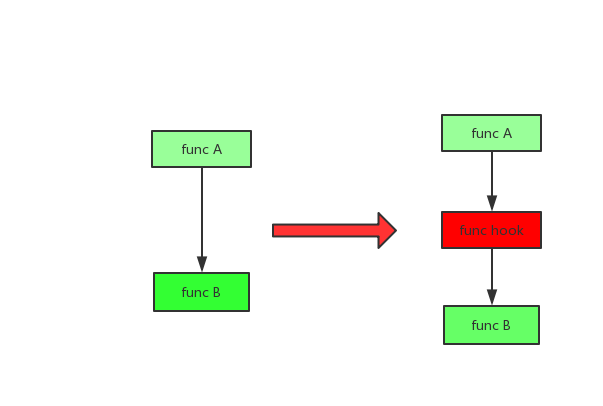
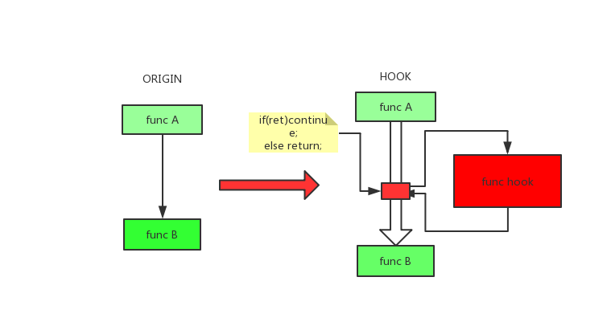

# linux内核态hook
linux内核支持动态加载module，今天不聊正常的module，只聊实现Hook的module.hook通常翻译做劫持，不过这个翻译听起来让人不舒服，感觉有点恐怖，所以大家都是喊行话:hook.

## hook的实现思路
### 修改系统调用表指针
因为大部分需要监控的是来自用户程序产生的动作，所以可以在系统调用层次上想想办法。所以Linux系统调用处理
都存储在sys_call_table位置，改变这个表的内容可以改变系统的行为。
最后我们可以通过保存原始的系统调用处理地址，并且把我们自己的hook代码地址放到系统调用表上。
[更多内容]()
### 使用LSM框架
LSM是内核官方的接口，在内核代码执行的关键点上埋下了hook点,安全模块可以注册这些hook方法，之后在执行过程中被回调，
hook方法可以知道上下文并且也能决定是否禁止这个操作。
### 使用kprobe
我们剩余的选项中有一个是kprobe,最初设计用来作内核的tracing和debugging.Kprobe允许你安装pre-handlers和post-handlers到任何的内核指令上，通常是函数的入口和返回处。处理函数访问寄存器并且操作他们。这个方式可以让我们有机会来监控和修改事件。
### 劫持LSM指针
LSM注册过的module最核心完成的一件事是注册LSM的回调，`static struct security_operations *security_ops`指针指向回调函数集，所以我们可以通过查找符号表找到该符号，然后修改指针值。
### Splicing
有一个非常传统的方法来配置内核的方法hook:通过替换函数开始地址的指令为一个为条件的跳转到你自己的处理函数。这个原始的指令挪到一个不同的位置并在返回到上一级函数时重新被调用。通过两次的跳转，可以拼接你的代码到这个过程。
## hook在不同体系下的实现原理
## hook的防护
