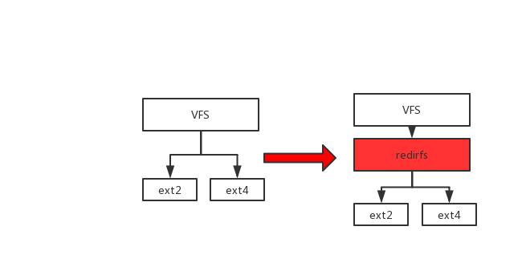
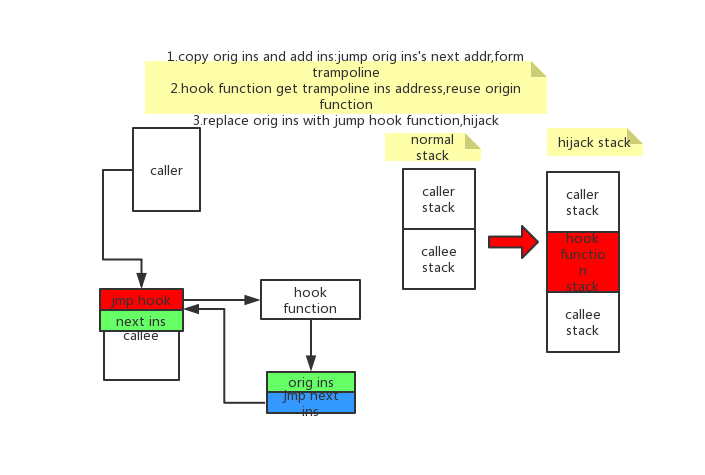
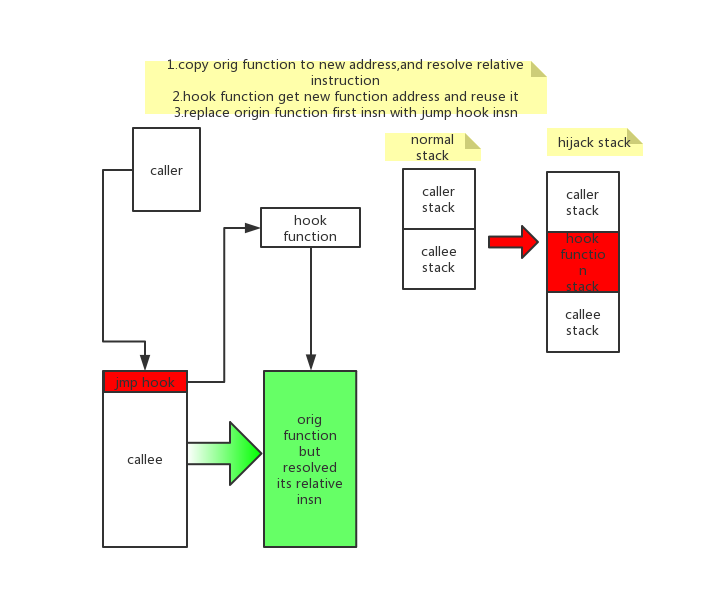

# linux内核态hook
linux内核支持动态加载module，今天不聊正常的module，只聊实现Hook的module.hook通常翻译做劫持，不过这个翻译听起来让人不舒服，感觉有点恐怖，所以大家都是喊行话:hook.


## hook的实现思路
### 修改系统调用表指针
因为大部分需要监控的是来自用户程序产生的动作，所以可以在系统调用层次上想想办法。系统调用的原理就是用户程序通过设置寄存器，之后通过异常指令主动触发异常，在异常处理中根据设置的寄存器查找一张表，就是系统调用号，每个系统都不一样，但是基本都是通过系统调用表实现的，区别只是这个表是否连续的。系统调用的规则可以通过`man syscall`来查看详细信息，下面是常见架构下的系统调用指令和返回值:
```
arch/ABI   instruction          syscall #   retval Notes
───────────────────────────────────────────────────────────────────
arm/OABI   swi NR               -           a1     NR is syscall #
arm/EABI   swi 0x0              r7          r0
arm64      svc #0               x8          x0
i386       int $0x80            eax         eax
x86_64     syscall              rax         rax    See below
x32        syscall              rax         rax    See below
```
Linux系统调用表都存储在sys_call_table位置，是一个连续的数组，通过改变这个表的内容就可以改变系统的行为。
我们可以通过保存原始的系统调用处理地址，并且把我们自己的hook代码地址放到系统调用表上。
[更多内容]()

检测方法:直接检测系统调用表中的地址和符号表中进行对比就知道是否被劫持了

### 使用LSM框架
LSM是内核官方的接口，在内核代码执行的关键点上埋下了hook点,安全模块可以注册这些hook方法，之后在执行过程中被回调，hook方法可以知道上下文并且也能决定是否禁止这个操作。

检测方法:直接查看`/sys/kernel/security/`

### 劫持LSM指针
LSM注册过的module最核心完成的一件事是注册LSM的回调，`static struct security_operations *security_ops`指针指向回调函数集，所以我们可以通过查找符号表找到该符号，然后像修改系统调用表一样修改指针值进行Hook。

检测方法:对比安全模块的Ops地址和LSM ops的指针地址

### 使用kprobe
我们剩余的选项中有一个是kprobe,最初设计用来作内核的tracing和debugging.`Kprobe`允许你安装pre-handlers和post-handlers到任何的内核指令上，通常是函数的入口和返回处。处理函数访问寄存器并且操作他们。这个方式可以让我们有机会来监控和修改事件。

它最早由[elfmaster](https://github.com/elfmaster/kprobe_rootkit)挖掘出hook的用途，同时也从这个这里看到，我们并不能直接通过返回值这种方式进行影响，而是操纵一些指针和其里面的内容来迂回的达到hook的目的，要实现一个功能会需要比较复杂的实现。所以它尽管能够在理论上hook所有的代码位置(标记__kprobes的除外)，但是选用的比较少。

kprobe是内核的标准框架，主要用于trace,所以辨别这类的hook难度较大，理论上它不是一个病毒。
### redirfs
堆栈类文件系统的代表，它通过正常的文件系统注册和某些文件路径下的hook操作，可以劫持所有的文件操作调用。通常在内核中是VFS下面挂接物理文件系统，而redirfs在中间插入了一层，相当于一层代理。  
  

缺点:它只能劫持file,dentry,inode,address_space的ops指针，对于网络流的控制不太强.
他目前由[slavaim](https://github.com/slavaim/redirfs)维护，但是里面有一些隐晦的bug需要自己处理，而且不能卸载，但是它管理的filter可以卸载。

优点:系统支持的接口，和lsm一样都不属于hacker的方式，应该不会被认为是一个病毒。它还有一个姐妹版的实现ecryptfs,是一个主要用来进行在文件系统层进行加密的文件系统，实现原理是相似的，不过ecryptfs挂载实例就是一个挂载点，原有的内容都会因为挂载而隐藏掉；而redirfs不影响现有的文件系统结构，只做hook。

### Splicing

有一个非常传统的方法来配置内核的方法hook:通过替换函数开始地址的指令为一个为条件的跳转到你自己的处理函数。这个原始的指令挪到一个不同的位置并在返回到上一级函数时重新被调用。通过两次的跳转，可以拼接你的代码到这个过程。里面的实现非常灵活，通常有以下几种劫持方式，主要描述指令执行流程和栈的变化:





著名的是tpe方法
检测方法:扫描内核的只读代码段，和vmlinux之类的静态elf代码段进行对比，耗时大

### ftrace
目前基于ftrace的`livepatch`功能已经成功合并到内核中，
## hook在不同体系下的实现原理

## hook的防护
