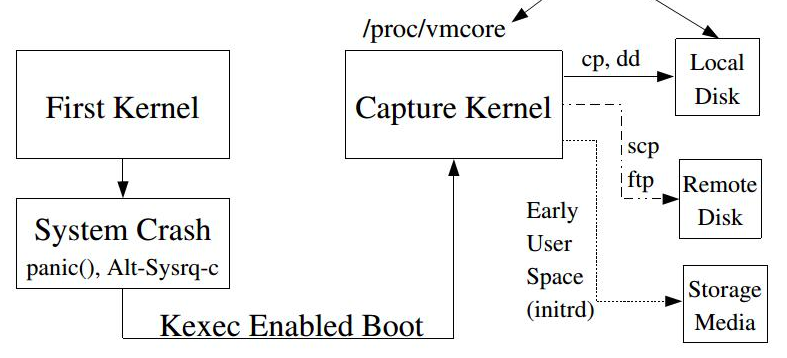
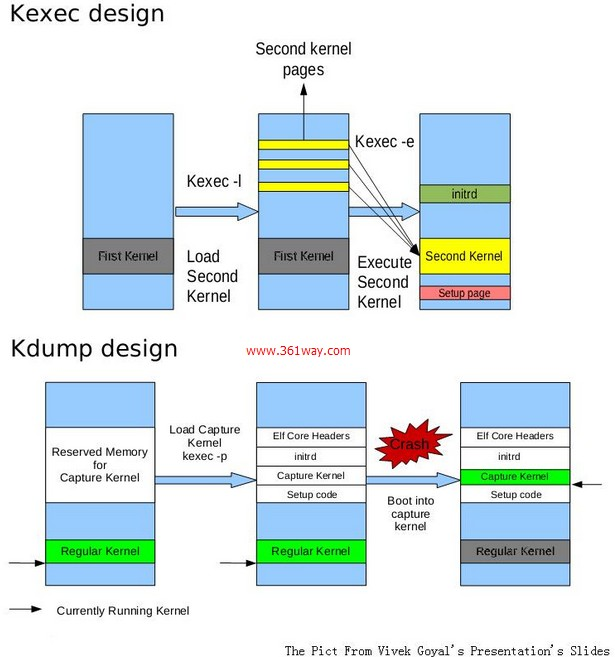

# kdump体系
做软件开发的同学会花费大约1/3的时间来进行调试，一个软件开发人员的技能包括:coding,调试和设计.一个友好的开发环境中必然提供了相当多的调试工具给开发人员，例如linux环境下C/C++有基于信号的core dump文件，java、python等都有自己的dump机制，而kdump就是为内核开发而生的dump机制，他是kernel dump的缩写。而dump主要是抓取程序在内存中状态，可以有多种格式，而在linux上elf大行其道。相对于其他的dump机制，他们都是运行于操作系统之上，底层有内核机制的支撑，但是内核是直接运行在硬件之上，它借助不了任何其他的机制帮助它，只能自己动手才能丰衣足食，这也是它的复杂之处。

kdump实际上有两个内核，一个是正常运行的内核，一个我们称为捕获内核/第二内核。  
1.首先需要通过`crashkernel=xxx@xxxx`来专门为kdump功能专门预留一部分内存，用来放置第二个内核和其他数据信息的。  
2.之后可以通过kexec系统调用，将第二个内核和initrd，vmcore信息，启动参数等传递给第一个内核。  
3.当系统崩溃时，保存当前寄存器信息，检查是否加载了捕获内核，如果存在则跳转到第二个内核，这部分的跳转基本都是arch相关的代码。  
因为没有经过ROM->BIOS->Grub->OS的过程而是直接跳转到第二个内核，RAM没有经过掉电的过程，所以不需要重新初始化，之后可以通过捕获内核启动并且暴露出的proc接口能够导出第一个内核的内存内容，普通的dump基本上就是对内存内容的拷贝，这样就会很大，所以有专门的工具makedumpfile可以不拷贝全是零的页并提供压缩选项。之后就可以通过crash工具像gdb分析core文件那样分析内核的数据了。

第一个内核需要如下的配置:
```
CONFIG_KEXEC=y
CONFIG_SYSFS=y
CONFIG_DEBUG_INFO=Y
```
捕获内核需要配置:
```
CONFIG_CRASH_DUMP=y
CONFIG_PROC_VMCORE=y
```

## kexec工具
kexec是个统称，它的名称应该是kernel exec,最重要的一部分工作是从第一个内核跳转到第二个内核，和用户空间的exec系统调用非常相似。
它主要有用户态的kexec工具，系统调用,内核的kexec feature。其中在内核2.6.16时添加系统调用kexec_load，在内核3.17之后添加了kexec_file_load系统调用，相比于第一个接口，后面的接口对于应用开发人员更加友好，将部分解析工作挪到了内核中。  
kexec主要是加载第二内核，而第二内核主要用来kdump功能和另一个是作为热启动。而启动一个系统除了内核镜像还需要一个根文件系统，它定义了init进程使系统从内核态过渡到用户任务。通常还需要一些cmdline，可以理解为系统的启动参数，可以提供给内核本身解析使用，也可以透传给用户进程来控制其行为。还有一个最重要的vmcore文件的头文件信息，它会根据`/proc/iomem`为每一个连续的内存块创建一个program table header,最后创建一个elf头，组合成vmcore的头信息然后通过“elfcorehdr=”传递个第一个内核，然后在捕获内核启动之后透传给`/proc/vmcore`,这样就控制了dump内核的什么位置并且怎么管理它们。

下面是更加形象的解释:


从图中看到，  
1.需要为第二内核预留部分内存，用来加载内核镜像，initrd,elfcorehdr,backup region等  
2.通过kexec-tools加载1中的内容，其中elfcorehdr是扫描当前的  
## 内核中的kexec

## vmcore导出

## crash工具的分析

## 参考
1.https://www.ibm.com/developerworks/cn/linux/l-kexec/index.html  
1.Documentation/kdump/kdump.txt  
http://lse.sourceforge.net/kdump/documentation/ols2005-kdump-presentation.pdf  
http://www.361way.com/centos-kdump/3751.html  
