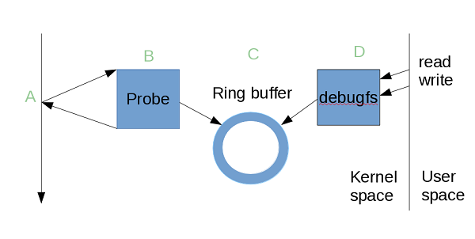

# ftrace
首先trace是跟踪的意思，通常被运维或者性能优化的同学使用，用来跟踪系统的状态，从用户态程序到内核中的trace.
和trace相似的有profile(剖析),profile通常是周期性查询cpu上的当前指令地址，而trace通常是在执行路径上埋桩,执行过程中输出采集。  

ftrace是function trace的简称，linux中trace的代名词，代表的是一个trace体系框架,可以划分成这四个组件:  
  
1.如何创建probe点  
2.probe之后处理函数  
3.probe中处理函数输出结果到ring buffer  
4.ring buffer如何向用户输出结果.  
其中3和4是基础结构,即通过debugfs向用户空间提供接口，而1和2实现方式可能会不一样，我更想将1和2理解成不同的插件,所有插件都利用了3和4的基础结构。  

ftrace中有一些主要的插件,下面会逐一介绍:  
event tracing,function trace,dynamic ftrace,kprobe,uprobe

目前ftrace最经常被用来trace这也是它最初设计的功能，在新版的kernel中还被用来热升级，也就是livepatch;
还有一种方式可以被用来进行Hook,最后一种使用的比较少，但是在内核4.14之后mainline已经支持这种[用法](https://elixir.bootlin.com/linux/v4.15.18/source/Documentation/trace/ftrace-uses.rst)了。

## tracepoint
trace point有很长时间的历史了，在3.9以前在内核中还有`samples/tracepoint`的使用示例，但是自从ftrace发展很成熟之后就不再推荐使用了，所以这个示例也被mainline删除了。

trace point就是开发人员手动地静态的在内核代码中插桩，之后可以向这个点注册处理函数。
在module中，会将tracepoint放进`__tracepoints`section中,名称字符串放进去`__tracepoints_str`,在module加载的时候会解析`__tracepoints`section的内容；内核初始化的时候注册了module事件处理callback`tracepoint_module_nb`,然后将tracepoint信息放到一个hash表中维护。之后注册tracepoint的处理函数只是将处理函数加入到tracepoint上的函数指针数组上，一个tracepoint支持多个callback.在函数调用过程中检查是否有callback,逐个调用。

### 代码片段示例:
预备工作的宏:
```
#define DEFINE_TRACE_FN(name, reg, unreg)				\
	static const char __tpstrtab_##name[]				\
	__attribute__((section("__tracepoints_strings"))) = #name;	\
	struct tracepoint __tracepoint_##name				\
	__attribute__((section("__tracepoints"))) =			\
		{ __tpstrtab_##name, 0, reg, unreg, NULL };		\
	static struct tracepoint * const __tracepoint_ptr_##name __used	\
	__attribute__((section("__tracepoints_ptrs"))) =		\
		&__tracepoint_##name;

#define DEFINE_TRACE(name)						\
	DEFINE_TRACE_FN(name, NULL, NULL);

#define DECLARE_TRACE(name, proto, args)                               \
       extern struct tracepoint __tracepoint_##name;                   \
       static inline void trace_##name(proto)                          \
       {                                                               \
               if (unlikely(__tracepoint_##name.state))                \
                       __DO_TRACE(&__tracepoint_##name,                \
                               TP_PROTO(proto), TP_ARGS(args));        \
       }                                                               \
       static inline int register_trace_##name(void (*probe)(proto))   \
       {                                                               \
               return tracepoint_probe_register(#name, (void *)probe); \
       }                                                               \
       static inline int unregister_trace_##name(void (*probe)(proto)) \
       {                                                               \
               return tracepoint_probe_unregister(#name, (void *)probe);\
       }
```
使用上面定义的宏生成tracepoint相关的信息,DECLARE_TRACE宏展开之后就是:`register_trace_subsys_event`和`unregister_trace_subsys_event`和tracepoint的函数`trace_subsys_event`;而DEFINE_TRACE展开之后就是将tracepoint的信息：名字放入`__tracepoints_strings`section中，tracepoint放入`__tracpoints`中。如此在插桩的时候就是插入了以函数，注册时候就是向插桩的函数处注册callback.
```
DECLARE_TRACE(subsys_event,            //宏展开之后
	TP_PROTO(struct inode *inode, struct file *file),
	TP_ARGS(inode, file));

DEFINE_TRACE(subsys_event);
static int my_open(struct inode *inode, struct file *file)
{
       int i;

       trace_subsys_event(inode, file);           //DEFINE展开之后就是trace_subsys_event函数
       return -EPERM;
}
```
注册tracepoint的callback:
```
static void probe_subsys_event(void *ignore,
			       struct inode *inode, struct file *file)
{
	path_get(&file->f_path);
	dget(file->f_path.dentry);
	printk(KERN_INFO "Event is encountered with filename %s\n",
		file->f_path.dentry->d_name.name);
	dput(file->f_path.dentry);
	path_put(&file->f_path);
}
register_trace_subsys_event(probe_subsys_event, NULL);
```
## event trace
使用 tracepoint 需要自己实现probe函数，而probe函数通常就是打印一些信息，每次都自己实现比较麻烦，而且还需要一个单独的内核模块来进行注册，不是很方便，所以在tracepoint上封装出了一个接口，probe函数采用固定的范式，根据tracepoint中组装成不同的probe函数，而probe函数的功能就是将信息输出到ring buffer中，这就是event trace做的最主要的工作。

除此之外，另外一个很重大的改进是将具有相同类型的:`TP_PROTO, TP_ARGS, TP_STRUCT__entry`的都归到一个类下，一方面形成一种树状的结构访问，另外一方面能够共用生成的赋值函数，打印函数，并且共享相同的存储类型，这样大大复用代码，减少了整个镜像的大小。  

event trace接口虽然抽象的比较好，但由于它本身的复杂性使用起来仍然是比较复杂，所以使用起来仍然比较复杂，[lwn上专门有三篇文章](https://lwn.net/Articles/379903/)来讲解怎么使用它的.第一章将基础的event trace使用，第二篇将如何将相似的event trace使用class封装成一个模板来减少代码生成和复用，第三篇讲解如何在module中使用event trace.推荐自行阅读。

目前tracepoint直接使用的已经非常少了，都是使用的在tracepoint上封装的event trace接口。

下面是根据`samples/trace_events/trace-events-sample.h`中的示例来查看一个trace event是怎么生成的。

*Tips*:  
自己可以写个简单的demo module看看，使用`EXTRA_CFLAGS='-save-temps'`保存预处理文件`.i`,之后就能在`/usr/lib/modules/$(uname -r)/build/{your_modulename.i}`中看到都生成了哪些代码。如果报错，找不到`your_modulename.h`,把它拷贝到`/usr/lib/modules/$(uname -r)/build/include/trace/`下。
```
make -C /usr/lib/modules/$(shell uname -r)/build M=$(shell pwd) modules EXTRA_CFLAGS='-save-temps'
```

- 1.一个宏实现 trace event

```
TRACE_EVENT(foo_bar,
       TP_PROTO(char *foo, int bar),
       TP_ARGS(foo, bar),
       TP_STRUCT__entry(
               __array(        char,   foo,    10        )
               __field(        int,    bar              )
       ),
       TP_fast_assign(
               strncpy(__entry->foo, foo, 10);
               __entry->bar    = bar;
       ),
       TP_printk("foo %s %d", __entry->foo, __entry->bar)
);
```
`TP_PROTO` 定义函数的原型。生成`trace_foo_bar(char *foo, int bar)`函数指针类型。

`TP_ARGS` 定义函数的参数，一定要与`TP_PROTO`中的参数名称一致;与上一个的区别，上面只是定义了函数的类型，它可以用来做类型转换。

`TP_STRUCT__entry` 定义记录在 ftrace 环形内存中数据的类型。它会被替换到定义一个结构体的变量 `__array ``代表数组类型，__field 是普通类型，它们分别等同于`` char foo[10], int bar`，我们会在后面看到它们怎么被替换到某个结构体中。

`TP_fast_assign` 说明将来在 probe 中这些 entry 会怎么记录在环形缓存中。

`TP_printk` 当我们通过 debugfs 查看 trace 的结果是，环形缓存中的数据并不是直接以二进制显示的，而是结构化输出的。`TP_printk `会被宏替换到输出的函数中。

通过这一个定义，多次宏替换，生成需要进行 event tracing 的所有函数，如果要是手写的话，可能会产生很多很多重复的代码。这个宏就是实现 event tracing 的核心。所有的事情用这一个定义就可以完成，TRACE_EVENT 被反复 `#define #undef` 用不同的代码模板制造出需要的代码。

第一次包含这个头文件，把 TRACE_EVENT 定义成 tracepoint。这是在 include/tracepoint.h 中实现的，如下:

- 2.实现 tracepoint

```
#define TRACE_EVENT(name, proto, args, struct, assign, print)   \
       DECLARE_TRACE(name, PARAMS(proto), PARAMS(args))
```
TRACE_EVENT 被定义成 DECLARE_TRACE ，而 DECLARE_TRACE 正是tracepoint需要的两个宏当中的一个，这里可以看到 event_tracing 确实是建立在 tracepoint 上的。

这个 TRACE_EVENT 宏已经被替换了，内核接下来会再次包含这个头文件，然后重新定义这个宏，以便把这个宏再展开成其它的代码，一个头文件再包含自己，这样不是形成一个死循环了么，事实上内核开发者使用一些标志巧妙的避开了这样的错误。TRACE_EVENT 在整个预编译过程中要被重新定义很多次，然后重新包含这个头文件，从而产成不同的需要的代码。这种宏虽然复杂，也不直观，但是它减少了代码的重复。试想，内核中也很多很多 event tracing，如果每一个子系统的定义自己的，那会产生多少类似的代码实现类似的功能。

第二次包含这个头文件，接下来会从新定义 TRACE_EVENT，以便产生其它代码。这是在 include/trace/define_trace.h，如下.

- 3.实现 tracepoint（续）

```
#undef TRACE_EVENT
#define TRACE_EVENT(name, proto, args, tstruct, assign, print)  \
       DEFINE_TRACE(name)
```
这里先 undef 了 TRACE_EVENT 的定义，然后又重行 define 它。这里 TRACE_EVENT 又被定义成 DEFINE_TRACE，而 DEFINE_TRACE 是上一章说的另一个宏。通过这两次宏展开，一个完整的 tracepoint 已经被实现了。

接下来 TRACE_EVENT 将致力于实现一个通用的 probe 函数。这个 probe 函数使用 ftrace 的环形缓存来输出数据，TRACE_EVENT 还将实现 debugfs 的接口，以便交互和控制。

第三次这个宏在 include/trace/ftrace.h 里 , 它会产生一个记录在环形缓存中的数据类型，在这个示例下面的数据类型。前面提到的 TRACE_EVENT 宏中的 `TP_STRUCT__entry `被定义成了这个数据结构。第一个元素是固定存在每条 trace 的记录中的。其余 foo 和 bar 是自定义的两个数据类型。它们其实是 probe 函数的两个参数。 probe 函数会将这两个参数记录到环形缓存区中。

- 4.记录在 ring buffer 中的数据类型

```
struct ftrace_raw_foo_bar {
       struct trace_entry ent;
        char foo[10];
       int bar;
       char __data[0];
};
```
接下来还会有接连几次重新定义这个宏，分别产生用于输出这条记录格式的相关函数，可以通过 debugfs 的 format 查看，我们不再关注，其中主要关注 probe 函数，也就是用于向环形缓存区写数据的函数，这个函数就是通过 tracepoint 注册的 probe 函数，用于将来被注册的 probe 函数，该函数在每次事件发生时记录相关的数据（foo, bar）到 ring buffer。这个函数是宏替换产生的，并不存在以内核代码中。可以通过 gcc 的 -E 来产生这个代码片段，事实上前文提到的也都是通过 gcc 的 -E 选项显示出来的。另一个比较重要的函数是读 debugfs 中的 trace 文件时候的回调函数。这个函数格式化环形缓存区中的输出。转化为用户易读取的格式。这个函数由 TP_printk 而来。

- 5.probe函数

```
static void ftrace_raw_event_id_foo_bar (struct ftrace_event_call *event_call,
                                        char *foo, int bar)
{
 …
 entry = ring_buffer_event_data(event);
 { strncpy(entry->foo, foo, 10);
   entry->bar = bar;; }
  f (!filter_current_check_discard(buffer, event_call, entry, event))
      trace_nowake_buffer_unlock_commit(buffer, event, irq_flags, pc);
};
```

最后，这些实现的所有函数被记录在6中的数据结构中，这个结构供 debugfs 文件系统使用。用户的与 debugfs 的交互将根据这张表来找到相应的操作，如本章开头示例的操作是，先使能这个事件的 trace event，也就是7中的命令，将通过 debugfs 调用 event_foo_bar.regfunc 这个函数，如清单 17，它将注册 ftrace_raw_event_id_foo_bar 这个 probe 函数到 probe 点。然后关闭就会调用 event_foo_bar.unregfunc 注销函数。tprobe 函数会在每次被调用是输出记录到 ring buffer，读取 trace 结果存在 .event 字段中的子系统实现。这样整个 event traceing 的实现就清晰了。

- 6.与 debugfs 交互数据结构

```
struct ftrace_event_call event_foo_bar = {
       .name = "foo_bar",
       .system = "sample",
       .event = &ftrace_event_type_foo_bar,
       .raw_init = trace_event_raw_init,
       .regfunc = ftrace_raw_reg_event_foo_bar,
       .unregfunc = ftrace_raw_unreg_event_foo_bar ,
       .show_format = ftrace_format_foo_bar ,
       .define_fields = ftrace_define_fields_foo_bar ,
       .profile_enable = ftrace_profile_enable_foo_bar,
       .profile_disable = ftrace_profile_disable_foo_bar,
};
```

- 7.注册注销函数

```
static int ftrace_raw_reg_event_foo_bar (struct ftrace_event_call *unused)
{
       return register_trace_foo_bar ( ftrace_raw_event_foo_bar );
}

static void ftrace_raw_event_foo_bar (char *foo, int bar)
{
       ftrace_raw_event_id_foo_bar (& event_foo_bar , foo, bar);
}
```

## tracer
Tracer有很多种，主要几大类:
```
函数类：function， function_graph， stack
延时类：irqsoff， preemptoff， preemptirqsoff， wakeup， wakeup_rt， waktup_dl
其他类：nop， mmiotrace， blk
```
Function tracer 和 Function graph tracer: 跟踪函数调用。

Schedule switch tracer: 跟踪进程调度情况。

Wakeup tracer：跟踪进程的调度延迟，即高优先级进程从进入 ready 状态到获得 CPU 的延迟时间。该 tracer 只针对实时进程。

Irqsoff tracer：当中断被禁止时，系统无法相应外部事件，比如键盘和鼠标，时钟也无法产生 tick 中断。这意味着系统响应延迟，irqsoff 这个 tracer 能够跟踪并记录内核中哪些函数禁止了中断，对于其中中断禁止时间最长的，irqsoff 将在 log 文件的第一行标示出来，从而使开发人员可以迅速定位造成响应延迟的罪魁祸首。

Preemptoff tracer：和前一个 tracer 类似，preemptoff tracer 跟踪并记录禁止内核抢占的函数，并清晰地显示出禁止抢占时间最长的内核函数。

Preemptirqsoff tracer: 同上，跟踪和记录禁止中断或者禁止抢占的内核函数，以及禁止时间最长的函数。

Branch tracer: 跟踪内核程序中的 likely/unlikely 分支预测命中率情况。 Branch tracer 能够记录这些分支语句有多少次预测成功。从而为优化程序提供线索。

Hardware branch tracer：利用处理器的分支跟踪能力，实现硬件级别的指令跳转记录。在 x86 上，主要利用了 BTS 这个特性。

Initcall tracer：记录系统在 boot 阶段所调用的 init call 。

Mmiotrace tracer：记录 memory map IO 的相关信息。

Power tracer：记录系统电源管理相关的信息。

Sysprof tracer：缺省情况下，sysprof tracer 每隔 1 msec 对内核进行一次采样，记录函数调用和堆栈信息。

Kernel memory tracer: 内存 tracer 主要用来跟踪 slab allocator 的分配情况。包括 kfree，kmem_cache_alloc 等 API 的调用情况，用户程序可以根据 tracer 收集到的信息分析内部碎片情况，找出内存分配最频繁的代码片断，等等。

Workqueue statistical tracer：这是一个 statistic tracer，统计系统中所有的 workqueue 的工作情况，比如有多少个 work 被插入 workqueue，多少个已经被执行等。开发人员可以以此来决定具体的 workqueue 实现，比如是使用 single threaded workqueue 还是 per cpu workqueue.

Event tracer: 跟踪系统事件，比如 timer，系统调用，中断等。
### nop
nop tracer并没有实质性的处理，被用来停止其他的tracer，它也通常作为默认的tracer在初始化时设置的。设置nop的时候就可以打开trace event了，其他的tracer都和trace event冲突。
### function

### function_graph
## dynamic ftrace

静态的ftrace就是使用类似于`gcc -pg`的机制在函数头部插入`mcount`,在其中会检查是否设置了`ftrace_trace_function`,如果没有设置的话,`ftrace_trace_function`就是指向一个`ftrace_stub`,那么直接返回。而如果设置了，执行`ftrace_trace_function`.原理非常简单，只是其中的实现依赖于架构相关，伪代码如下:
```
void ftrace_stub(void)
{
	return;
}
void mcount(void)
{
	/* save any bare state needed in order to do initial checking */

	extern void (*ftrace_trace_function)(unsigned long, unsigned long);
	if (ftrace_trace_function != ftrace_stub)
		goto do_trace;
	/* restore any bare state */
	return;

do_trace:
	/* save all state needed by the ABI (see paragraph above) */

	unsigned long frompc = ...;
	unsigned long selfpc = <return address> - MCOUNT_INSN_SIZE;
	ftrace_trace_function(frompc, selfpc);

	/* restore all state needed by the ABI */
}
```
而动态ftrace所要做的就是针对这种情况进行优化，通常情况下并没有人打开trace,每次调用`mcount`都会造成性能损失，这时候使用类似于`nop`的指令来代替`mcount`.
当有人打开trace的时候，将`mcount`的指令再修改回来。对于没有打开trace的时候进行了很大的有话提升。

实现方式:

- 1.编译的时候，将所有function的`mcount`地址汇聚到一个代码段中，起始地址`__stop_mcount_loc`到结束地址`__start_mcount_loc`
- 2.系统初始化的时候，为每一个`mcount`地址都分配一个`struct dyn_ftrace`,保存着名称和地址，将地址中的`mcount`替换为`nop`指令;
	对于module,注册module notify,当module插入的时候动态分配`struct dyn_ftrace`来保存其地址信息。在module卸载的时候删除其信息。
- 3.在激活的时候，再将`mcount`恢复到函数原始的代码位置，检查是那种trace function.

## kprobe
kprobe 是很早前就存在于内核中的一种动态 trace 工具。kprobe 本身利用了 int 3（在 x86 中）实现了 probe 点，这对应于 A 部分的功能。使用 kprobe 需要用户自己实现 kernel module 来注册 probe 函数。可以看出 kprobe 并没有统一的 B、C 和 D。使用起来用户需要自己实现很多东西。不是很灵活。而在 function trace 出现后，kprobe 借用了它的一部分设计模式，实现了统一的 probe 函数（对应于图中的 B），并利用了 function trace 的环形缓存和用户接口部分，也就是 C 和 D 部分功能，用户可以使用读写 debugfs 中相关文件就可以控制 kprobe 的注册注销以及读取结果，非常方便。
## uprobe
## ringbuffer
## trace-cmd
## 问题
### 使用function_graph tracer崩溃问题
```
echo "function_graph" > /sys/kernel/debug/tracing/current_tracer
```
在上面的echo语句导致崩溃之后重启重启,使用kdump抓不到任何的crash.在vmware中报

   清除孤立的inode <inode>

我试图重现这个问题，将函数的current_tracer值replace成C程序中的其他东西：
```
include <stdio.h>                                                                 
#include <fcntl.h>                                                                 
#include <unistd.h>                                                                
#include <string.h>                                                                
#include <stdlib.h>                                                                
int openCurrentTracer() {                                                          
    int fd = open("/sys/kernel/debug/tracing/current_tracer", O_WRONLY);           
    if(fd < 0) exit(1); return fd;                                                 
}                                                                                  
int writeTracer(int fd, char* tracer) {                                            
    if(write(fd, tracer, strlen(tracer)) != strlen(tracer)) {                      
        printf("Failure writing %s\n", tracer); return 0;                          
    } return 1;                                                                    
}                                                                                  
int main(int argc, char* argv[]) {                                                 
    int fd = openCurrentTracer();                                                  
    char* blockTracer = "blk";                                                     
    if(!writeTracer(fd, blockTracer)) return 1; close(fd);                         
    fd = openCurrentTracer();                                                      
    char* graphTracer = "function_graph";                                          
    if(!writeTracer(fd, graphTracer))                                              
        return 1;                                                                  
    close(fd);                                                                     
    printf("Preparing to fail!\n");                                                
    fd = openCurrentTracer();                                                      
    if(!writeTracer(fd, blockTracer)) return 1;                                    
    close(fd);                                                                     
    return 0;                                                                      
}
```
奇怪的是，C程序不会崩溃我的系统。

我最初在使用Ubuntu（Unity环境）16.04 LTS时遇到了这个问题，并确认它是4.4.0和4.5.5内核中的一个问题。 我也在运行Ubuntu（Mate环境）15.10，在4.2.0和4.5.5内核上的机器上testing过这个问题，但是无法重现这个问题。 这只会让我更加困惑。

任何人都可以给我洞察发生了什么？ 具体来说，为什么我能够`write()`但不能`echo /sys/kernel/debug/tracing/ current_tracer`？

**更新**

正如vielmetti指出的，其他人也有类似的问题（如这里所见）。

>ftrace_disable_ftrace_graph_caller()假定它在jmp（e9）附近有一个5字节，则在ftrace_graph_call修改jmp指令。 然而，这是一个由2个字节组成的简短jmp（eb）。 而ftrace_stub()位于ftrace_graph_caller正下方，所以上面的修改会破坏ftrace_stub()中的内核oops的指令，如下所示的无效操作码：

补丁（如下所示）解决了echo问题，但我仍然不明白为什么echo先前打破了write()不是。

>https://lkml.org/lkml/2016/5/16/493  
>http://zgserver.com/ftraceechofunction_graphcurrent_tracer.html

## debugfs中接口
```
通用配置：
available_tracers-------------当前编译及内核的跟踪器列表，current_tracer必须是这里面支持的跟踪器,记录向内核注册的tracer。
current_tracer----------------用于设置或者显示当前使用的跟踪器列表。系统启动缺省值为nop，使用echo将跟踪器名字写入即可打开。可以通过写入nop重置跟踪器。

buffer_size_kb----------------用于设置单个CPU所使用的跟踪缓存的大小。跟踪缓存为RingBuffer形式，如果跟踪太多，旧的信息会被新的跟踪信息覆盖掉。需要先将current_trace设置为nop才可以。
buffer_total_size_kb----------显示所有的跟踪缓存大小，不同之处在于buffer_size_kb是单个CPU的，buffer_total_size_kb是所有CPU的和。

free_buffer-------------------此文件用于在一个进程被关闭后，同时释放RingBuffer内存，并将调整大小到最小值。

tracing_cpumask---------------可以通过此文件设置允许跟踪特定CPU，二进制格式。
per_cpu-----------------------CPU相关的trace信息，包括stats、trace、trace_pipe和trace_pipe_raw。
　　　　　　　　　　　　　　　　　　stats：当前CPU的trace统计信息
　　　　　　　　　　　　　　　　　　trace：当前CPU的trace文件。
　　　　　　　　　　　　　　　　　　trace_pipe：当前CPU的trace_pipe文件。
printk_formats----------------提供给工具读取原始格式trace的文件。
saved_cmdlines----------------存放pid对应的comm名称作为ftrace的cache，这样ftrace中不光能显示pid还能显示comm。
snapshot----------------------是对trace的snapshot。
                              echo 0清空缓存，并释放对应内存。
                              echo 1进行对当前trace进行snapshot，如没有内存则分配。
                              echo 2清空缓存，不释放也不分配内存。

trace-------------------------查看获取到的跟踪信息的接口，echo > trace可以清空当前RingBuffer。
trace_pipe--------------------输出和trace一样的内容，但是此文件输出Trace同时将RingBuffer中的内容删除，这样就避免了RingBuffer的溢出。可以通过cat trace_pipe > trace.txt &保存文件。

trace_clock-------------------显示当前Trace的timestamp所基于的时钟，默认使用local时钟。local：默认时钟；可能无法在不同CPU间同步；global：不同CUP间同步，但是可能比local慢；counter：这是一个跨CPU计数器，需要分析不同CPU间event顺序比较有效。
trace_marker------------------从用户空间写入标记到trace中，用于用户空间行为和内核时间同步。
trace_marker_raw--------------以二进制格式写入到trace中。

trace_options-----------------控制Trace打印内容或者操作跟踪器，可以通过trace_options添加很多附加信息。
options-----------------------trace选项的一系列文件，和trace_options对应。

trace_stat/-------------------每个CPU的Trace统计信息
tracing_max_latency-----------记录Tracer的最大延时，
tracing_on--------------------用于控制跟踪打开或停止，0停止跟踪，1继续跟踪。
tracing_thresh----------------延时记录Trace的阈值，当延时超过此值时才开始记录Trace。单位是ms，只有非0才起作用。

Events配置：
available_events--------------列出系统中所有可用的Trace events，分两个层级，用冒号隔开。
events/-----------------------系统Trace events目录，在每个events下面都有enable、filter和fotmat。enable是开关；format是events的格式，然后根据格式设置 filter。
set_event---------------------将Trace events名称直接写入set_event就可以打开。
set_event_pid-----------------指定追踪特定进程的events。

Function配置：
available_filter_functions----记录了当前可以跟踪的内核函数，不在该文件中列出的函数，无法跟踪其活动。
dyn_ftrace_total_info---------显示available_filter_functins中跟中函数的数目，两者一致。
enabled_functions-------------显示有回调附着的函数名称。
function_profile_enabled------打开此选项，在trace_stat中就会显示function的统计信息。
set_ftrace_filter-------------用于显示指定要跟踪的函数
set_ftrace_notrace------------用于指定不跟踪的函数，缺省为空。
set_ftrace_pid----------------用于指定要追踪特定进程的函数。

Function graph配置：
max_graph_depth---------------函数嵌套的最大深度。
set_graph_function------------设置要清晰显示调用关系的函数，在使用function_graph跟踪器是使用，缺省对所有函数都生成调用关系。
set_graph_notrace-------------不跟踪特定的函数嵌套调用。

Stack trace设置：
stack_max_size----------------当使用stack跟踪器时，记录产生过的最大stack size
stack_trace-------------------显示stack的back trace
stack_trace_filter------------设置stack tracer不检查的函数名称

Kernel dynamic events设置:
kprobe_events
kprobe_profile

Userspace dynamic events设置:
uprobe_events
uprobe_profile
```
## 参考
https://www.ibm.com/developerworks/cn/linux/1609_houp_ftrace/  
https://static.lwn.net/kerneldoc/trace/ftrace-uses.html  
https://lwn.net/Articles/379903/  
https://lwn.net/Articles/381064/  
https://lwn.net/Articles/383362/  
