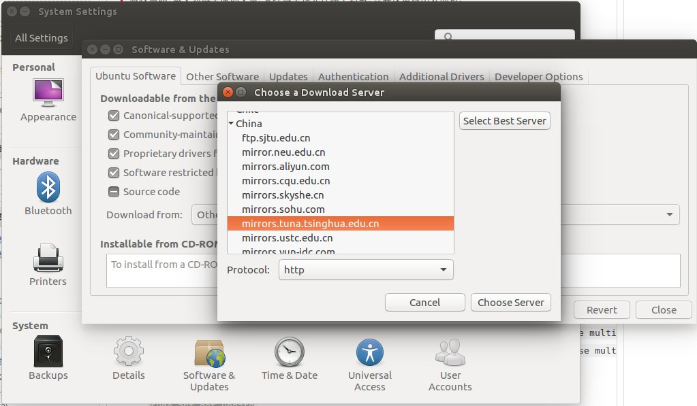

# Systemp安装过程:

1. sudo apt-get install systemtap systemtap-server

安装完工具需要先做一个检查:
```
sudo stap-prep
```
如果没有任何提示则表示工具安装没有问题.

不过如果你没有特殊的配置的话，是需要安装`Linux-image-xxx-dbgsym`;

合适的ubuntu源可以加快你下载的速度,毕竟dbgsym比不带符号的可执行文件大多了；

可以进行百度搜索ubuntu源，也可以到ubuntu的wiki上找对应版本的源，这里只提供一个比较简单的方法来选择源:



Setting->Software&Updates->Download from:->清华tuna的源

如果不是教育网的话，可以选择163或着阿里云;然后apt-get update之后下载dbgsym


如果凑巧你的内核版本没有可用的dbgsym,那么你可能需要自己编译一个dbgsym:
```
$ cd $HOME
$ sudo apt-get install dpkg-dev debhelper gawk
$ mkdir tmp
$ cd tmp
$ sudo apt-get build-dep --no-install-recommends linux-image-$(uname -r)
$ apt-get source linux-image-$(uname -r)
$ cd linux-2.6.31 (this is currently the kernel version of 9.10)
$ fakeroot debian/rules clean
$ AUTOBUILD=1 fakeroot debian/rules binary-generic skipdbg=false
$ sudo dpkg -i ../linux-image-debug-2.6.31-19-generic_2.6.31-19.56_amd64.ddeb
```

如果碰到stap-server无论如何也起不来的情况,爆出类似于如下错误的时候
```
stap -e 'probe begin { exit() }'
Server: No matching machine owner key (MOK) available on the server to sign the module.
Server: The server has no machine owner key (MOK) in common with this system. Use the following command to import a server MOK into this system, then reboot:

        mokutil --import signing_key.x509
Passes: via server failed.  Try again with another '-v' option.
```
1.检查你的ubuntu是否是UEFI启动的
```
efibootmgr
```
如果输出一些内容而不是报错，你本次是通过UEFI启动的

2.检查你的biso中`secure boot`是否enable,请disable掉这个功能然后启动,再次尝试一下
