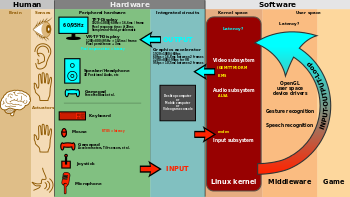
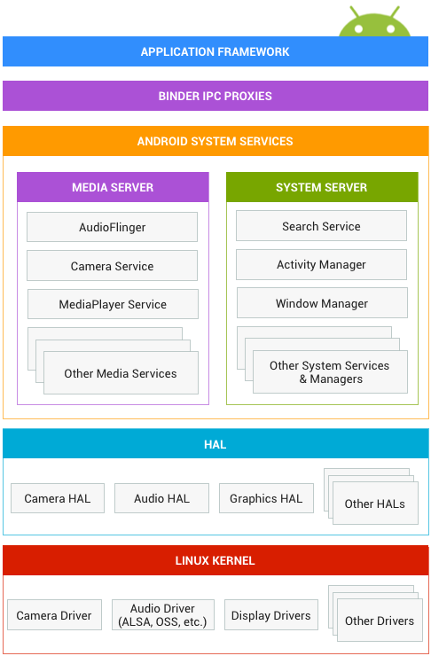
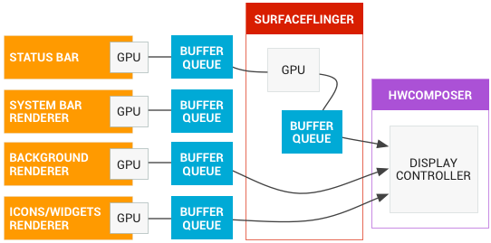
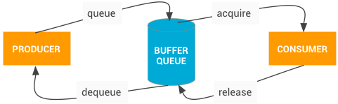

# Android Graphic Arch
Android是现在大多数国人使用的手机上搭载的系统，现在的低头族就是指手机族，不过是中间由部分IOS用户而已.低头族们都在干什么呢，浏览网页，游戏，看视频，听歌，分解动作无非两个：`点击触摸屏`和`查看屏幕`;
再来看PC行业中Windows的崛起，也是那年搭载了Windows95之后才流行起来的，中间不得不提的苹果公司，两个公司流行的原因很大一部分是具有良好的图形界面，非编程人员也能使用计算机;
从这个角度看来，windows之后的几十年没有革命性的变化,无非就是图形漂亮点；
而对比一下pc和手机，我们发现iphone和android为什么突然间将大部分的功能机淘汰,通过重新定义了一种交互方式，其中一点就是通过触摸屏解放了相当大的空间用来显示，就类似于我们对于电视尺寸的不满足.

这篇主要是对着google的官方手册进行理解

盗图一张，没办法，外果仁画得就是好(https://en.wikipedia.org/wiki/Graphical_user_interface);

用户和一个设备进行交互的方式:输入，输出，输入是指用户通过鼠标，键盘，触摸屏，摇杆等设备操作，驱动接收到事件向系统上层分发，框架层和app层根据输入事件进行相应的反应，而反应的结果通常是通过显示输出来反映最终的状态；从这个角度上来看输入和输出和用户的体验密切相关;这篇主要讲一些概况的东西

## Graphic Arch

先看google设计的整体框图

最顶层是各种应用，也包括系统应用:SystemUI,StatusBar,Launcher等;

应用通过Binder和系统的framework进行通信，最典型的是system_server(里面有各个重要的java类服务:AMS,WMS,PMS等)，不过这个不是很明显，都是通过AIDL封装起来了，用户根本不需要知道进程间通信的手段;

光有Java类的服务是不够的，最终用户的各种请求总结来说就是请求使用系统的各种资源，是需要和系统打交道的;所以这类管理系统资源的服务一般都是有Native的服务相对应，这里就经常看到JNI了;

下面是HAL层:Hardware abstract Layer,是将各种硬件层的接口抽象出来，特别是为同一类设备抽象出相同的接口;访问设备时不用关心底层的设备到底是哪一种，你只需要只需要关注策略即可;

下面一层就是kernel了，负责管理系统中各个设备，使用户空间程序不必关心设备的寄存器/比特流等具体的实现方式，只需要调用接口即可;

从纵向来看，从上到下是一体的，状态理应是一致的；越往上越不必关心设备的工作原理，越往下越需要对硬件工作机制有所了解;

上面的都是一些粗浅道理，贻笑大方.

Android Graphic framework向应用开发者提供了大量的2D/3D图形渲染API,下面通过和厂商的图形设备驱动配合工作来完成整个绘图过程;下面的都是在一个比较高的层次上看这些API;

应用开发者在绘图时可以采用两种方式:Canvas和OPENGL，这些需要参考系统级的Android图形组件的arch；

android.graphics.Canvas是一个2D图形API也是在开发者中非常流行的API.Canvas操作绘制所有的android.view.Views.在Android中，Canvas硬件加速是通过OpenGLRenderer图形绘制库来将Canvas操作转换为可以在GPU上执行的OpenGL操作.
从Android4.0上Canvas硬件加速默认开启.所以之后的Android版本设备强制硬件GPU支持OpenGL ES 2.0。
硬件加速绘图怎么工作的和软件绘制的区别.
我们知道PC上刚开始是只有一个CPU的，后来出现图形界面，然后才有了GPU;而对比ARM发展的历程，也是后来才有专门的GPU，像mali系列;
CPU和GPU的区别:C:control的意思，更加侧重于控制，附带能力是计算;G是Graphics，而图形学基本上离不开向量，矩阵的运算，GPU算是一种DSP专门来处理类似的数据运算.
而软件上也反映了这些不同;OPENGL是一种标准的图形接口规范，应用开发者只需要调用这些接口就可以完成绘图，具体怎么做的由厂商各自实现，只需要保证和接口描述保持一致.mesa作为OPENGL的一种流行跨平台实现，里面根据硬件不同的能力选择不同的方式绘制:swrast,而此时驱动是softpipe或者根据LLVM编译出的llvmpipe;
在Android上没有使用OpenGL而是使用了阉割版的GLES，只保留了常见的接口;Mesa也实现了GLES，最新的MESA 17.2实现了GLES 3.2;而Android没有直接使用GLES而是利用EGL作为本地窗口系统和GLES的桥梁,EGL负责处理图形管理、表面/缓冲捆绑、渲染同步及支援使用其他Khronos API进行的高效、加速、混合模式2D和3D渲染;
具体GPU(intel核显,Nvdia,AMD等)的工作需要内核的driver,用户空间设备特定的drm,类似于libdrm-intel,libdrm-amd,还需要MESA中支持相应的GPU，而mesa是比较复杂的，需要依赖drm_gralloc，drm,特别是LLVM，而LLVM的依赖关系更加复杂，略去不表;如此才能较好地发挥GPU的性能.

除了Canvas，开发者主要就是通过OpenGL ES来直接渲染到一个surface中.Android在android.opengl包中提供了OpenGL ES接口，开发者可以通过调用SDK的API；另一个选择是使用NDK中提供的native API.

## Android graphics components

无论开发者使用哪种rendering API，都是将渲染后的数据放入一个surface。这个surface代表了一个bufferqueue的producer端，一般是SurfaceFlinger充当consumer端.每一个windows创建时都会在后台提供一个surface。所有可见的带有渲染后数据的surface被surfaceflinger合成放入一个显示buffer中;

下图显示的是图形framework的arch图

主要的组件描述如下:

- 图形流的生产者端:

一个图形产生源可以是任何组件，例如OpenGL ES,Canvas 2D,mediaserver 视频解码等，提供图形buffer给消费者

- 图形流的消费者端:

最常见的图形流消费者是SurfaceFlinger，这个系统服务消耗当前可见的surface然后根据window manager提供的信息将他们合成到一个display buffer中.SurfaceFlinger是唯一能够修改显示内容的服务.SurfaceFlinger使用OpenGL或硬件来做合成的工作.

其他的OpenGL ES app也可以消费这些应用流，例如camera app可以接收一个camera预览图形流。非GL的应用也可以消费这些producer的数据，例如ImageReader类；
- Window Manager

The Android system service that controls a window, which is a container for views. A window is always backed by a surface. This service oversees lifecycles, input and focus events, screen orientation, transitions, animations, position, transforms, z-order, and many other aspects of a window. The Window Manager sends all of the window metadata to SurfaceFlinger so SurfaceFlinger can use that data to composite surfaces on the display.
Android系统服务中有以非常重要的系统服务AMS,主要管理window对象，每一个window都包含一些view并且每个window一般有一个surface资源.这个服务监视activity的生命周期，输入，focus事件，屏幕旋转，过渡，动画，位置，转换，z轴排序和其他要素.
- Hardware Composer

硬件抽象显示子系统:surfaceflinger可以将某些合成工作放到专用硬件(这个可能是一个单独的硬件也可能是GPU的一个单元)上来进行，以此来减轻OpenGL和GPU的工作负载.当没有专用合成硬件时SurfaceFlinger使用GLES，此时时作为一个OPENGL ES客户端工作.所以当SurfaceFlinger显式地合成一个或多个buffer时，可以使用hwc方式,这种合成方式能够比GPU来做能够更加专业,更加节能.

硬件合成HAL层还需要做另外的一半工作，需要支持一些事件,其中一个是VSYNC事件，还有是HDMI的插拔事件(当没有专用hwc时就这些事件没准放到了gralloc里面).
- Gralloc
图形内存分配(Gralloc:graphics alloc)需要处理图形生产者分配内存请求;而其实存在另外一个问题，gralloc为每一个进程分配内存，而进程是访问虚拟地址的，所以这里有一个非常重要的mapping动作是需要和graphicmapper来一起完成的.
## Data flow

左侧的对象是产生渲染之后的图形数据buffer的地方，像home屏幕，状态栏，系统UI.SurfaceFlinger是这个合成器，上面也说了最好使用hwc硬件合成.
- BufferQueue

BufferQueue将不同Android图形组件间连接了起来。从生产者到消费者中间有一对queue(两个queue，一个位于生产者侧，一个位于消费者侧，没侧都有一个buffer)。一旦生产者确定buffer数据生产完成，SurfaceFlinger得到通知后就会合成输出到显示器上

BufferQueue负责传输生产者到消费者那里。像Camera预览，有cameral HAL层或者OPENGL ES游戏产生数据等这样的图形生产者；还有SurfaceFlinger或者其他的显示一个OPENGL ES流的app，例如camera app显示camera视图的.

BufferQueue是一个数据结构，将一个queue的的缓冲池和使用Binder将buffer在进程间传递.生产者接口或者你传递给某些应用产生图形数据，就是一个IGraphicBufferProducer(代表部分SurfaceTexture).
BufferQueue经常被用作渲染数据存储的对象，然后被GL处理掉.

BufferQueue可以在三种模式下操作:

同步模式:BufferQueue默认处于同步模式，bufferqueue从生产者出来然后被消费者处理掉。没有任何的buffer被丢弃掉.如果生产者太快，比它们被扔掉的速度还要块，将会阻塞并且等待free buffer.

非阻塞模式:BufferQueue也可以处于非阻塞模式，不会一直等待buffer而是产生错误.这种模式下也不会有buffer被丢弃.在预防应用软件中潜在的死锁时非常游泳.

丢弃模式:可以直接丢弃速度产生过快的buffer而不是出错或者等待.例如，如果GL渲染到一个纹理视图过快，buffer有可能被丢掉.

为了构建这些工作，SurfaceFlinger作为另外一个OpenGL ES的客户端.当SurfaceFlinger是显式合成一个或多个buffer时，可以使用OpenGL ES.

- Synchronization framework
硬件合成器HAL层还有另外一半的工作:作为Android图形渲染的中心点.

因为Android图形没有提供具体的并行机制，厂商很长一段时间必须在他们自己的driver中自己实现同步机制,对Android graphics同步机制并没有什么需求.

Android同步框架显式地描绘了系统中不同异步操作的依赖。提供了一个简单的API:当buffer被释放的时候发送信号.也允许同步原语从kernel的driver中传递到用户空间中，或者在不同的用户空间程序中使用.

例如:应用可能入队一个到GPU上执行的工作，然后GPU开始绘制图形。尽管这个图形还没有绘制到buffer中，这个buffer的指针仍然可以被传递到一个窗口合成器中，不过需要带有一个fence来表示GPU工作还没有完成.窗口和城市然后开始提前处理并且将工作交给显示控制器.在这种方式中，CPU工作可以提前做完。一旦GPU完成绘制工作，然后显示控制器就可以立即显示这些图形.

这个同步框架也允许在硬件中被利用来同步其他的资源.最终为了方便调试这个框架想图形pipeline中提供可见性

## Low-level components

底层组件:
BufferQueue和gralloc:BufferQueue链接图形数据的生产方到接收这些数据进行显示或者进一步处理方;Buffer的申请是通过一个vendor特定的HAL层来实现的gralloc内存分配器接口;

SurfaceFlinger,硬件合成器和虚拟显示：SurfaceFlinger接收多个buffer数据然后合成它们并发送到显示设备中.HWC中使用可用的专用硬件设备用最高效的方式来合成buffer.虚拟显示器能够使合成显示在系统内部可用，例如录屏并通过网络发送这些数据.

Surface,Canvas,SurfaceHolder:一个Surface代表一个buffer队列，被SurfaceFlinger来处理掉.当渲染数据到一个Surface中时，结果存储在buffer中并传递给消费者.Canvas API提供了一个软件实现(有硬件加速支持)直接绘制到一个Surface(底层可以被OpenGL ES支持).任何对象想要处理一个包含SurfaceHolder的View，这些APIs使能获取和设置Surface参数size和format.
    EGLSurface and OpenGL ES. OpenGL ES (GLES) defines a graphics-rendering API designed to be combined with EGL, a library that knows how to create and access windows through the operating system (to draw textured polygons, use GLES calls; to put rendering on the screen, use EGL calls). This page also covers ANativeWindow, the C/C++ equivalent of the Java Surface class used to create an EGL window surface from native code.
EGLSurface和OpenGL ES:GLES定义了一个图形渲染API并和EGL来配合,并知道通过操作系统如何创建和访问窗口(调用GLES绘制纹理图形;调用EGL来将渲染数据放到屏幕上).EGL中非常重要的一点是将GLES和Android的Window结合起来，就是ANativeWindow(Android NativeWindow),和Java层Surface类等同的C/C++实现，从native代码中创建EGL窗口.

Vulkan:低消耗，跨平台的高性能3D图形API.像GLES，Vulkan提供工具来在应用中创建高质量的，实时的图形.Vulkan的优势在于减少CPU的消耗并支持SPIR-V二进制中间语言.

这个也是从N上才有的一个选择，看评测是比传统的OPENGL实现效率要更高一些，不过还是需要看硬件的支持程度。软件上的支持应该还是放在mesa库里进行的，从201607之后的版本才支持这个API。硬件上的支持需要去看各个GPU的，intel在2016年7月支持vulkan 1.0，不过并没有使用gallium 3d的驱动框架，而是自己实现的。

这种现象一般和技术没有关系，只是上层的商业决策影响了技术实现现状。
## High-level components

SurfaceView and GLSurfaceView:SurfaceView包含一个surface和一个view，其中view是由SurfaceFlinger合成过来的，不通过app的UI渲染线程而是通过一个单独的线程来进行渲染的;GLSurfaceView提供了一些帮助类来辅助管理EGL上下文，线程间通信，和Activity生命周期的交互.

SurfaceTexture:包含一个Surface和GLES文理来创建一个BufferQueue,而应用是具体的consumer.具体的应用场景:Camera和Video播放;我们大概都了解一些流行的美图软件，当然系统camera应用中一般也会自带一些功能,自拍的时候可以选择好多的特效:磨砂，美肤，大眼睛等等;当Camera捕捉到一个图像之后传递给上层应用，而此时我们不希望立即显示而是把这帧数据处理过后再进行显示;

当一个producer入队一个新的buffer，通知应用，应用释放上一个buffer，为这个queue申请新的buffer,通过EGL调用来使这个buffer作为外部纹理可被GLES使用.Android7.0支持使能GPU保护视频内容时进行安全文理视频播放

TextureView:包含View和SurfaceTexture.封装了一个SurfaceTexture并负责响应回调和申请新的buffer.当绘图时，TextureView使用最近接收到的buffer作为自己的数据源，不管View状态如何渲染任何的数据.通过GLES进行View合成
