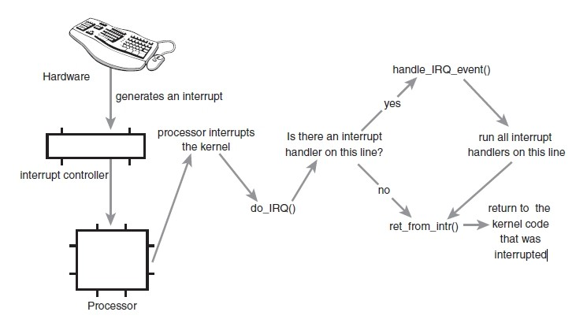

# kernel的重要点总结
## 进程
[详细](2017-07-27-process.md)

### 进程创建
### 进程调度
#### 调度策略
#### runqueue
#### vruntime
#### 抢占
##### 内核抢占
##### 用户抢占
#### 进程切换
### 负载均衡
#### 负载均衡时机
#### 负载均衡策略
## 中断
## 内存管理
### 物理内存管理
#### 伙伴系统
#### 每cpu高速缓存
### 内存系统初始化
### 虚拟内存管理
### swap
### 缓存
### 页面回收
### 页表
### 缺页异常
## 信号
## 中断
从本质上来讲，中断是一种电信号，当设备有某种事件发生时，它就会产生中断，通过总线把电信号发送给中断控制器。
如果中断的线是激活的，中断控制器就把电信号发送给处理器的某个特定引脚。处理器于是立即停止自己正在做的事，
跳到中断处理程序的入口点，进行中断处理。

(1) 硬中断  
由与系统相连的外设(比如网卡、硬盘)自动产生的。主要是用来通知操作系统系统外设状态的变化。比如当网卡收到数据包
的时候，就会发出一个中断。我们通常所说的中断指的是硬中断(hardirq)。

(2) 软中断  
为了满足实时系统的要求，中断处理应该是越快越好。Linux为了实现这个特点，当中断发生的时候，硬中断处理那些短时间
就可以完成的工作，而将那些处理事件比较长的工作，放到中断之后来完成，也就是软中断(softirq)来完成。

(3) 中断嵌套  
linux下硬中断是可以嵌套的，但是没有优先级的概念，也就是说任何一个新的中断都可以打断正在执行的中断，但同种中断
除外。软中断不能嵌套，但相同类型的软中断可以在不同CPU上并行执行。  

(4) 软中断指令  
int是软中断指令。  
中断向量表是中断号和中断处理函数地址的对应表。   
int n - 触发软中断n。相应的中断处理函数的地址为：中断向量表地址 + 4 * n。  

### 硬件中断过程
### 软中断过程
### 硬中断和软中断的区别

软中断是执行中断指令产生的，而硬中断是由外设引发的。  
硬中断的中断号是由中断控制器提供的，软中断的中断号由指令直接指出，无需使用中断控制器。  
硬中断是可屏蔽的，软中断不可屏蔽。  
硬中断处理程序要确保它能快速地完成任务，这样程序执行时才不会等待较长时间，称为上半部。  
软中断处理硬中断未完成的工作，是一种推后执行的机制，属于下半部。  
## 临界区
### 原子锁
### 信号量
### 原子变量的实现原理
### 死锁
## 文件系统
### VFS
### 具体的文件系统
## IO子系统
### IO架构
### 调优
## module
## 内核安全审计
## 设备驱动模型
### 初始化和地址空间
## kernel实践记录
### debug方法
### qemu+kernel
### kgdb
### panic
### user mode linux
### 重要的全局变量
### ramdump和crash分析
### how to submit a patch to kernel
### kernel名人录
### kprobe
### perf工具
### ftrace
### systemtap
