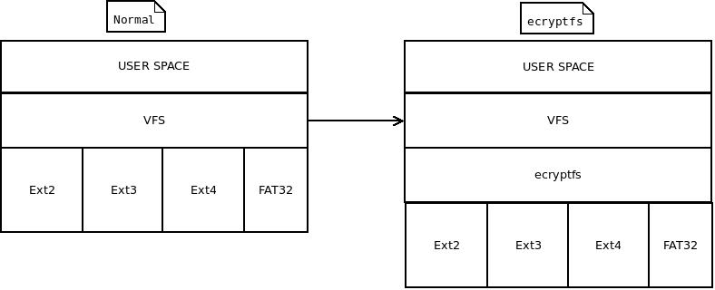
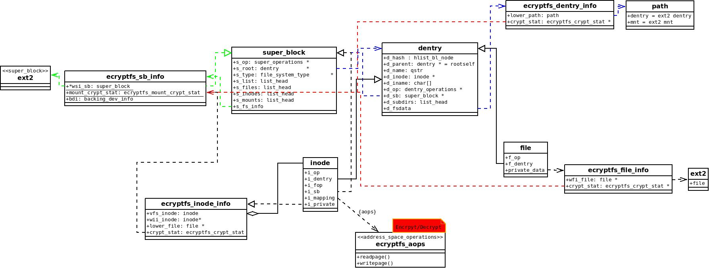
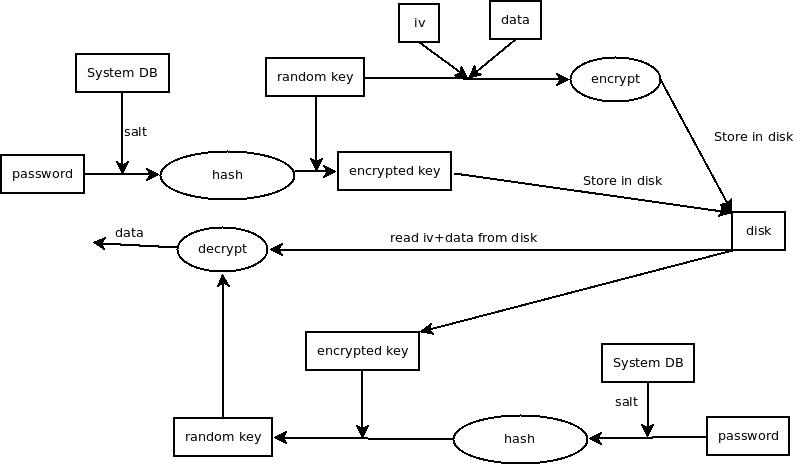

# ecryptfs
参考Halcrow的论文:`eCryptfs: An Enterprise-class Encrypted Filesystem for Linux`  
特别是下面这位大牛的解析:http://bobao.360.cn/learning/detail/4531.html
## 背景
ecryptfs:Extend cryptfs,翻译做`扩展加密文件系统`，其作用类似于GnuPG程序，对数据进行加密，但是中间重要的区别就是不需要用户手动进行加密和解密工作.  
ecryptfs使用内核现有的很多其他服务,例如keyring(密钥管理服务),crypto API(加密算法框架)等;keyring进行一些密钥管理任务，crypto负责数据加密任务.  
ecryptfs是一个堆叠式的文件系统，位于VFS和实际文件系统中间层,它自己不和实际的块设备打交道，也不怎么和用户打交道，一般情况下用户是不知道这个程序存在的;  
  
在VFS文件系统设计之初,主要是根据ext2来设计的vfs层接口，不过也给那些和ext2格式不太像的文件系统留下来一些接口:`super_block->s_fs_info`,`inode->i_private`,`dentry->d_fsdata`等，ecryptfs就是利用这些私有接口来实现自身的一些特定功能；  

ecryptfs做的事主要有两种,一个是怎么嵌入到现有的文件系统框架，另外一个是实现数据加密  
利用现有文件系统框架:  
我们看到现在的VFS很成熟了，支持的物理文件系统也是非常多的，索性就不再添加本身具有加密功能的文件系统，例如Reiser4;而是实现一个加密层，利用现有的文件系统磁盘布局和软件架构，写加密文件时先将内存中的明文加密，然后传给下层普通文件系统，由它们真正地写入物理介质。读加密文件时先通过下层普通文件系统将文件的密文读入内存，解密后再将明文返回到上层的用户进程；
类似于ecryptfs的堆叠式加密文件的优势在于实现相对容易（因为功能相对简单）且用户可以任意选择下层的普通文件系统来存放加密文件，也不必转换文件系统.
## 数据结构
VFS中有几个重要的结构体，代表了关键的几个角色:file_system_type,inode,dentry,super_block,file;    
1.VFS私有数据指向ecryptfs，ecryptfs中相应的结构体也指向VFS，能够很方便的互相转换;  
2.定义自己的加密解密功能实现,然后利用现有的物理文件系统进行读写数据  
    
```
向系统中注册ecryptfs文件系统，当它作为module存在的时候，在主动mount的时候会触发module初始化，注册该文件系统
static struct file_system_type ecryptfs_fs_type = {
        .owner = THIS_MODULE,
        .name = "encfs",
        .mount = ecryptfs_mount,    //主动挂载ecryptfs时触发该动作
        .kill_sb = ecryptfs_kill_block_super,
        .fs_flags = 0
};
ecryptfs私有的属性信息，特别是记录加密解密的mount_crypt_stat.ecryptfs下的dentry,inode,file等都从这里获得加解密信息
struct ecryptfs_sb_info {
        struct super_block *wsi_sb;    //指向物理文件系统的super_block
        struct ecryptfs_mount_crypt_stat mount_crypt_stat;//每一个实例即每一个ecryptfs挂载后,加密解密控制信息
        struct backing_dev_info bdi;   //后备设备???，和tmpfs等一样是没有真实物理设备的，即没有回写等
};
```
下面的结构体就是单独列出来,ecryptfs其实就是夹在vfs和具体的fs中间的一层
```
struct ecryptfs_file_info {
        struct file *wfi_file;    //指向VFS的file
        struct ecryptfs_crypt_stat *crypt_stat;  //指向inode的加密信息
};
/* inode private data. */
struct ecryptfs_inode_info {
        struct inode vfs_inode;   //指向VFS的inode
        struct inode *wii_inode;  //指向实际文件系统的inode
        struct mutex lower_file_mutex;
        atomic_t lower_file_count;  //底层
        struct file *lower_file;  //实际文件系统的file指针
        struct ecryptfs_crypt_stat crypt_stat;   //加密信息存储
};

/* dentry private data. Each dentry must keep track of a lower
 * vfsmount too. */
struct ecryptfs_dentry_info {
        struct path lower_path;          //实际的路径
        struct ecryptfs_crypt_stat *crypt_stat;
};
```
支持对文件名和文件内容进行加解密，从物理设备上读取出来然后解密，分别表示了vfs和物理数据
```
struct ecryptfs_filename {
        struct list_head crypt_stat_list;
#define ECRYPTFS_FILENAME_CONTAINS_DECRYPTED 0x00000001
        u32 flags;
        u32 seq_no;
        char *filename;                           //文件名
        char *encrypted_filename;                 //加密过的文件名
        size_t filename_size;                     //文件名长度
        size_t encrypted_filename_size;           //加密过的文件名长度
        char fnek_sig[ECRYPTFS_SIG_SIZE_HEX];     //文件名加密密钥签名
        char dentry_name[ECRYPTFS_ENCRYPTED_DENTRY_NAME_LEN + 1];  //文件名称
};
每个文件加解密信息
struct ecryptfs_crypt_stat {
        u32 flags;             //加密的属性，比较复杂
        unsigned int file_version;
        size_t iv_bytes;            //初始化向量的长度
        size_t metadata_size;       //元数据的长度，当这些信息存储在xattr字段中时，最小8192Bytes
        size_t extent_size;           /* 每一次需要加密的数据长度 */
        size_t key_size;              //口令的长度，也是从mount_crypt_stat中得出
        size_t extent_shift;          //加密数据size的位移，从mount_crypt_stat中得出
        unsigned int extent_mask;     //加密数据分片的掩码，从mount_crypt_stat中得出
        struct ecryptfs_mount_crypt_stat *mount_crypt_stat;
        struct crypto_ablkcipher *tfm;  //加密算法
        struct crypto_hash *hash_tfm; /* Crypto context for generating
                                       * the initialization vectors */
        unsigned char cipher[ECRYPTFS_MAX_CIPHER_NAME_SIZE];      //加密算法的种类
        unsigned char key[ECRYPTFS_MAX_KEY_BYTES];                //获取系统随机数生成的密钥
        unsigned char root_iv[ECRYPTFS_MAX_IV_BYTES];             //初始随机变量，现在是通过计算key的md5值，共16bytes
        unsigned char inode_iv[8];
        struct list_head keysig_list;           //从mount_crypt_stat中取出口令保护信息,添加到这里
};
文件系统mount时传入的信息:
struct ecryptfs_mount_crypt_stat {
        /* Pointers to memory we do not own, do not free these */
        u32 flags;
        struct list_head global_auth_tok_list;    //认证密钥，每一个ecryptfs拥有一个密钥ecryptfs_global_auth_tok;为了多用户共享文件，会有一串的密钥
        struct mutex global_auth_tok_list_mutex;
        size_t global_default_cipher_key_size;    //文件内容加密算法
        size_t global_default_fn_cipher_key_bytes;  //文件名称加密:  
  
加密后文件和普通文件有一些不一样的地方，这些文件内容是经过加密的，而用户读文件的时候需要解密文件;  
非对称加密安全性较好，但是速度很慢，一般用来加密`对称加密的密钥`;对称加密的加密计算速度比非对称加密快太多了，所以用来进行文件内容加密.  
文件内容是对称加密的，而且文件头处记录了对称加密相关的信息:算法，所以还需要对称加密的密钥，但是有不能明着写密钥，所以在文件中存放的是使用`用户口令`加密`对称加密的密钥`的密钥。

核心思想：eCryptfs通过一种对称密钥加密算法来加密文件的内容或文件名，如AES-128，密钥 FEK（File Encryption Key）随机产生。而FEK通过用户口令或者公钥进行保护，加密后的FEK称EFEK（Encrypted File Encryption Key），口令/公钥称为 FEFEK（File Encryption Key Encryption Key）。在保存文件时，将包含有EFEK、加密算法等信息的元数据（metadata）放置在文件的头部或者xattr扩展属性里（本文默认以前者做为讲解），打开文件前再解析metadata。

加密信息布局:  
下面是使用用户口令保护密钥时加密信息的排布方式
```
 *   Header Extent:
 *     Octets 0-7:        Unencrypted file size (big-endian)
 *     Octets 8-15:       eCryptfs special marker
 *     Octets 16-19:      Flags
 *      Octet 16:         File format version number (between 0 and 255)
 *      Octets 17-18:     Reserved
 *      Octet 19:         Bit 1 (lsb): Reserved
 *                        Bit 2: Encrypted?
 *                        Bits 3-8: Reserved
 *     Octets 20-23:      Header extent size (big-endian)
 *     Octets 24-25:      Number of header extents at front of file
 *                        (big-endian)
 *     Octet  26:         Begin RFC 2440 authentication token packet set
	/* This format is inspired by OpenPGP; see RFC 2440
	 * packet tag 3 */
	1                         /* Tag 3 identifier */
	+ 3                       /* Max Tag 3 packet size */
	+ 1                       /* Version */
	+ 1                       /* Cipher code */
	+ 1                       /* S2K specifier */
	+ 1                       /* Hash identifier */
	+ ECRYPTFS_SALT_SIZE      /* Salt */
	+ 1                       /* Hash iterations */
	+ key_rec->enc_key_size); /* Encrypted key size */
 *   Data Extent 0:
 *     Lower data (CBC encrypted)
 *   Data Extent 1:
 *     Lower data (CBC encrypted)
```
## 过程
## 初始化
加载该module时进行一些初始化工作，资源的预分配,其中最重要的一项是注册了file_system_type到内核中
```
static int __init ecryptfs_init(void)
{
int rc;
//eCryptfs的extent size不能大于page size
if (ECRYPTFS_DEFAULT_EXTENT_SIZE > PAGE_CACHE_SIZE) {
rc = -EINVAL;  ecryptfs_printk(KERN_ERR，…); goto out;
}
/*为上文列举到的eCryptfs重要的数据结构对象申请内存，如eCryptfs的auth token、superblock、inode、dentry、file、key等*/
rc = ecryptfs_init_kmem_caches();
…
 //建立sysfs接口，该接口中的version各bit分别代表eCryptfs支持的能力和属性
rc = do_sysfs_registration();
…
//建立kthread，为后续eCryptfs读写lower file时能借助内核函数得到rw的权限
rc = ecryptfs_init_kthread();
…
//多个用户同时登录时，处理自己的事件;创建/dev/ecryptfs设备，提供ecryptfs_miscdev_fops
rc = ecryptfs_init_messaging();
…
//初始化kernel crypto
rc = ecryptfs_init_crypto();
…
//注册eCryptfs文件系统
rc = register_filesystem(&ecryptfs_fs_type);
…
return rc;
}
```
## mount
挂载时用户可以选择一些挂载选项:
```
文件加密算法
文件名加密算法
口令
```
注册了eCryptfs的内核，当用户在应用层下发`mount –t ecryptfs src dst options`命令时触发ecryptfs_mount函数进行文件系统的挂载安装并初始化auth token，成功执行后完成对src目录的eCryptfs属性的指定，eCryptfs开始正常工作，此后任何在src目录下新建的文件都会被自动加密处理;若之前该目录已有加密文件，此时会被自动解密;如果挂载点已经挂载了ecryptfs再次挂载ecryptfs时会失败,不支持重复ecryptfs.
```
ecryptfs_mount{
	//解析mount时的参数，初始化super_block->ecryptfs_mount_crypt_stat
	ecryptfs_parse_options(sbi, raw_data, &check_ruid);
	//实例化super_block,注册到系统中
	sget(fs_type, NULL, set_anon_super, flags, NULL);
	//super_block互相关联1:super_block->s_fs_info=ecryptfs_sb_info
	ecryptfs_set_superblock_private(s, sbi);

	//关联super_operations和dentry_operations
	s->s_op = &ecryptfs_sops;//当创建文件时，ecryptfs->alloc_inode被调用,初始化自己的一些加密信息
	s->s_d_op = &ecryptfs_dops;

	rc = kern_path(dev_name, LOOKUP_FOLLOW | LOOKUP_DIRECTORY, &path);
	//如果mountpoint已经在ecryptfs下，则不能再次加密
	if (path.dentry->d_sb->s_type == &ecryptfs_fs_type) {
		rc = -EINVAL;
	}
	//super_block互相关联2:ecryptfs_sb_info->wsi_sb=super_block
	ecryptfs_set_superblock_lower(s, path.dentry->d_sb);

	//ecryptfs的super_block信息大多数都是通过原有的物理文件系统中直接拿过来的，即遵守物理文件系统的约束
	s->s_flags = flags & ~MS_POSIXACL;
	s->s_flags |= path.dentry->d_sb->s_flags & (MS_RDONLY | MS_POSIXACL);

	s->s_maxbytes = path.dentry->d_sb->s_maxbytes;
	s->s_blocksize = path.dentry->d_sb->s_blocksize;
	s->s_magic = ECRYPTFS_SUPER_MAGIC;
	//利用物理文件系统的接口创建一个inode，定制inode的数据
	//inode->i_mapping->a_ops = &ecryptfs_aops;
	//inode->i_mapping->backing_dev_info = inode->i_sb->s_bdi;
	//if (S_ISLNK(inode->i_mode))
	//	inode->i_op = &ecryptfs_symlink_iops;
	//else if (S_ISDIR(inode->i_mode))
	//	inode->i_op = &ecryptfs_dir_iops;
	//else
	//	inode->i_op = &ecryptfs_main_iops;
	//if (S_ISDIR(inode->i_mode))
	//	inode->i_fop = &ecryptfs_dir_fops;
	//else if (special_file(inode->i_mode))
	//	init_special_inode(inode, inode->i_mode, inode->i_rdev);
	//else
	//	inode->i_fop = &ecryptfs_main_fops;
	inode = ecryptfs_get_inode(path.dentry->d_inode, s)
	//初始化super_block的root dentry,关联dentry,inode,super_block
	s->s_root = d_make_root(inode);

	root_info = kmem_cache_zalloc(ecryptfs_dentry_info_cache, GFP_KERNEL);

	//dentry互相关联:dentry->d_fsdata=ecryptfs_dentry_info,ecryptfs_dentry_info->lower_path->dentry=dentry
	//ecryptfs_dentry_info->lower_path->vfsmount=mnt
	ecryptfs_set_dentry_private(s->s_root, root_info);
	ecryptfs_set_dentry_lower(s->s_root, path.dentry);
	ecryptfs_set_dentry_lower_mnt(s->s_root, path.mnt);

```
解析挂载选项:

之后创建文件，读取文件，写文件都会经过ecryptfs的操作
## 创建文件
当执行`echo "test" > ecryptfs/helloworld.txt`时,会调用ecryptfs_create来创建一个文件和ecryptfs_writepage写入内容
```
ecryptfs_create{

	ecryptfs_do_create(directory_inode, ecryptfs_dentry, mode);
		vfs_create
		__ecryptfs_get_inode
			iget5_locked
				alloc_inode
					sb->s_op->alloc_inode
	ecryptfs_initialize_file(ecryptfs_dentry, ecryptfs_inode);
		ecryptfs_write_metadata
			ecryptfs_write_headers_virt
				ecryptfs_write_metadata_to_contents
	d_instantiate(ecryptfs_dentry, ecryptfs_inode);
}
```
1.ecryptfs_do_create会利用物理文件系统在磁盘上真正创建一个inode来，然后__ecryptfs_get_inode初始化ecryptfs的私有信息
2.ecryptfs_initialize_file真正和普通文件区别开来:在metadata区域或者inode的第一个数据区写入加密信息:
	每一个文件都有自己的加密信息，部分内容是相同的，还有一部分是不同的，ecryptfs_new_file_context获取各方信息组成属于这个文件的加密信息
```
struct ecryptfs_crypt_stat {
        u32 flags;             //加密的属性，比较复杂
        unsigned int file_version;
        size_t iv_bytes;            //初始化向量的长度
        size_t metadata_size;       //元数据的长度，当这些信息存储在xattr字段中时，最小8192Bytes
        size_t extent_size;           /* 每一次需要加密的数据长度 */
        size_t key_size;              //口令的长度，也是从mount_crypt_stat中得出
        size_t extent_shift;          //加密数据size的位移，从mount_crypt_stat中得出
        unsigned int extent_mask;     //加密数据分片的掩码，从mount_crypt_stat中得出
        struct ecryptfs_mount_crypt_stat *mount_crypt_stat;
        struct crypto_ablkcipher *tfm;
        struct crypto_hash *hash_tfm; /* Crypto context for generating
                                       * the initialization vectors */
        unsigned char cipher[ECRYPTFS_MAX_CIPHER_NAME_SIZE];      //加密算法的种类
        unsigned char key[ECRYPTFS_MAX_KEY_BYTES];                //获取系统随机数生成的密钥
        unsigned char root_iv[ECRYPTFS_MAX_IV_BYTES];             //初始随机变量，现在是通过计算key的md5值，共16bytes
        unsigned char inode_iv[8];
        struct list_head keysig_list;           //从mount_crypt_stat中取出口令保护信息,添加到这里
};
```
3.ecryptfs_write_metadata取出加密信息写入到一段内存空间中，然后写入到metadata的xattr中还是content中
目前从代码中来看还不支持写入到metadata中:因为将ecryptfs数据写入到metadata中需要自己定义一些set_xattr的hook方法，目前没有写ecryptfs数据的方式.

## 加密
```
ecryptfs_aops.writepage
	ecryptfs_writepage
		ecryptfs_encrypt_page
			ecryptfs_encrypt_extent
				ecryptfs_encrypt_page_offset
					encrypt_scatterlist
```
## 解密
```
ecryptfs_aops.readpage
	ecryptfs_readpage
		ecryptfs_decrypt_page
			ecryptfs_read_lower
			ecryptfs_decrypt_extent
				ecryptfs_decrypt_page_offset
					decrypt_scatterlist
```
**真实的加密和解密都是在ecryptfs address_space_operation中做的，然后再交给物理文件系统的address_space_operation来继续**
