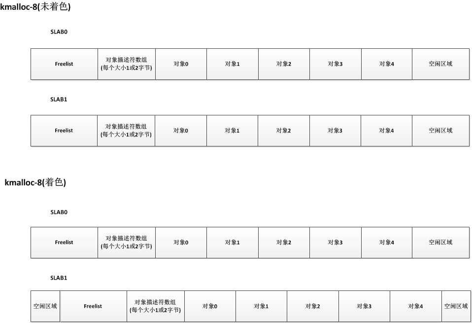
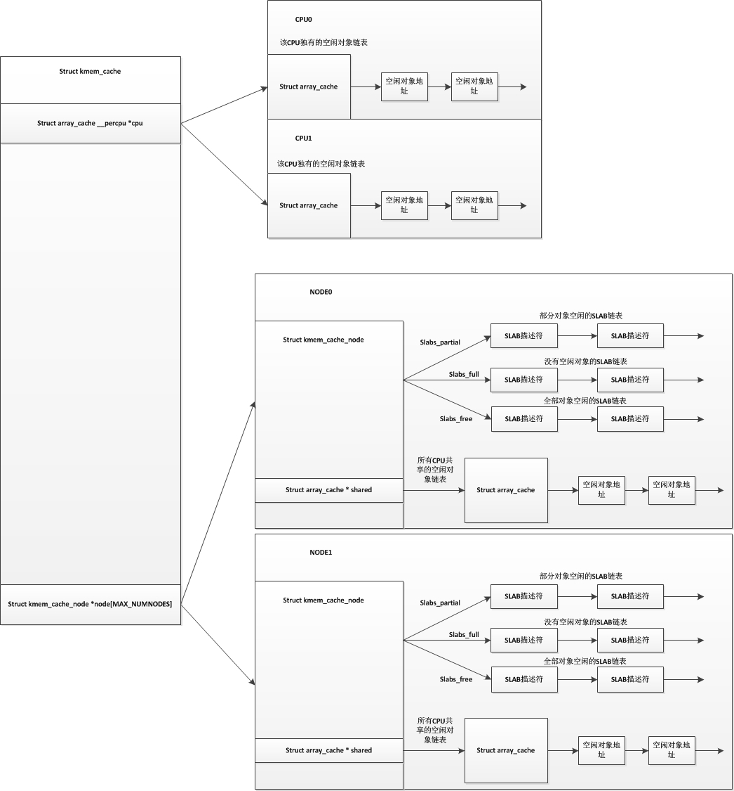

---                                                                                                                                                                                                                
layout:     post
title:      "Linux内存管理"
date:       2017-12-27 23:00:00
author:     "faxiang1230"
header-img: "img/post-bg-2015.jpg"
catalog: true
tags:
  - kernel
  - memory
---

# Linux内存管理
限定：主要是指32位上，单节点，开启MMU，有HIGHMEM区域中的内存管理
## 内存初始化
系统如何直到物理内存的信息？如何管理这些内存的？  
在x86上我们知道是通过e820寄存器获得系统物理内存信息，不是很了解x86,暂且不表.  
在ARM上有两种方式获得物理内存的信息，通过uboot传过来、通过device tree信息获得,分别在`setup_machine_tags`和`setup_machine_fdt`解析获得;目前android上大部分都是通过第二种方式传递给kernel，有一些使用uboot的仍然采用atags的方式传送过来。具体可以参考`Documentation/arm/Booting`  
获得信息之后如何管理这些内存?  
不管是x86还是arm，都会将信息保存在一种通用的结构中:`memblock`
```
struct memblock {
	phys_addr_t current_limit;
	struct memblock_type memory;  //所有可用的内存
	struct memblock_type reserved; //被系统占用的内存，将不会传递给zone管理
};
```
通过device tree传递的物理内存信息转换：  
在`setup_machine_fdt`中通过early_init_dt_scan_memory来获取memory的节点,最后加入到memblock中，里面分成两部分，总的内存memblock->memory和已经被占用的内存memblock->reserved;
```
drivers/of/fdt.c
early_init_dt_scan_memory(unsigned long node, const char *uname,
				     int depth, void *data)
{
	char *type = of_get_flat_dt_prop(node, "device_type", NULL);

	reg = of_get_flat_dt_prop(node, "linux,usable-memory", &l);
	endp = reg + (l / sizeof(__be32));
	while ((endp - reg) >= (dt_root_addr_cells + dt_root_size_cells)) {
		u64 base, size;

		base = dt_mem_next_cell(dt_root_addr_cells, &reg);
		size = dt_mem_next_cell(dt_root_size_cells, &reg);
		early_init_dt_add_memory_arch(base, size);
	}
}
```
上面是加入到memblock->memory中，表示总的可用物理内存;  
下面就是需要将内核占用的物理内存在reserved中标示出来，通常都有的内核的`text`,`data`, `initrd`,`swapper_pg_dir`,`dtb`,`DMA`  

然后在物理页面之后就是页表的初始化,在`prepare_page_table`清除VMALLOC之下的所有页表,重头戏都在`map_lowmem->create_mapping`,遍历pgd,pmd,然后分配pte空间，然后填充pte,pmd.在现在的arm中只有二级页表，pgd=pmd，关于pmd的操作就是操作pgd。
这里有个点:arm的MMU中PGD是20位，剩余的是标志位，但是在linux需要一些额外的标志位,YOUNG(表示页最近访问过),DIRTY(页内容被改变了)，而arm的硬件没有这些标志位，所以需要在软件上实现这些标志，在相应的操作中，置软件标志位.实际上pgd entry仍然是4字节的，每个entry可以指向2^8个pte项，每个pte项占据4字节，所以pgd指向的pte连续空间为1024字节空间，每个页4k空间，4个pgd可以指向同一页的pte，但是这里取巧操作，每两个pgd指向一个页，公2048字节，两外的2048字节保存软件标志位；而pgd在软件上看是每个entry占据8字节，指向一页空间的pte，相邻的两个地址可以共用一个页基地址；

下面映射dma,remap,fixmap,vmalloc区域。

下面就是填充pglist_data和各个zone的数据

## 页表
在启动MMU的系统中如何通过虚拟地址找到物理页？MMU中的作用？
1.MMU中看到的物理地址，所以pgd,pte中存储的都是页物理地址
2.linux理论上支持4极页表，而32位上一般使用2级页表，64位上使用3级页表
3.内核的页表在swapper_pg_dir
4.mm_struct->pgd是虚拟地址，因为处于线性映射，在装入MMU之前会转换为物理地址访问

### arm页表

## 物理页分配和释放
### buddy
### alloc_page
分配时提供的参数:order和gfp_t,order是指阶数，需要分配`2^order`;gfp_t(Get free page)中有两种标志：从那个zone中分配，称为`Zone modifiers`，另外一种描述是`Action modifiers`；可以参考`include/linux/gfp.h`
理想情况下页的分配：
1.通过gfp_t中找到优先从哪个zone中分配，顺带确定后备分配区域zonelist
pglist_data中有一个zonelist node_zonelists，在初始化时确定这个数组里的顺序，从低到高分别是:Highmem->normal->dma,如果确定优先从normal区域中分配，当normal中不足时尝试从dma中获取，却不会去highmem中查找。
2.查找normal中的buddy中的free_area中链表，从order阶开始查找是否有足够的页满足要求
3.如果`free_area[order]`上没有的话，就继续查找`free_area[order]`到`free_area[MAX_ORDER]`,找到之后需要拆分高阶连续的页并且挨个放入低阶链表中(expand)
4.如果没有足够的页，尝试到后备分配区域中查找，需要满足条件:例如优先从normal中分配，现在需要到dma中分配，需要dma区域中`free page > watermark[high]+lowmem_reserve[1]`,lowmem_reserve的计算参考说明`Documentation/sysctl/vm.txt`中关于`lowmem_reserve_ratio`和`setup_per_zone_lowmem_reserve`实现方式
5.如果都不满足的话，尝试进行页面回收之后再次尝试分配
引起睡眠的分配API:
### slab
slab是为小块内存分配提供的一种管理方式  
slab:  
slab可以看作是一组页，通常是一个页，当页从buddy中移到slab中管理时，slab就代表这个页
```
struct slab {
		struct {
			struct list_head list;          //挂入partial,free,full中
			unsigned long colouroff;        //color是指缓存行，colouroff是color offset,指缓存行可以占据的空间
			void *s_mem;		                //这个代表coloroff之后的位置
			unsigned int inuse;	            //这个slab中有多少个对象在被使用
			kmem_bufctl_t free;             //这个其实是char free[kmem_cache->num],每个字节和一个obj关联
			unsigned short nodeid;
		};
};
```


slab分配总体样子:  


分配时，先从`kmem_cache->array_cache`中寻找，如果找不到再从`kmem_cache->kmem_cache_node->shared`中分配，然后再从`kmem_cache->kmem_cache_node->slabs_free`分配，不足的时候再从`per_cpu_pages`或`buddy`中分配.
### per_cpu_pages
适合单个页的分配
## 虚拟地址空间
### 寻找vma
### 插入vma
## 逆向映射
### amv
## 页缓存
## 页回收
## 缺页异常
