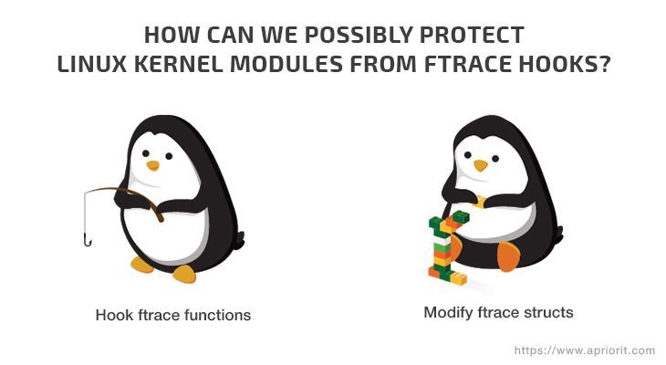

# ftrace来进行内核hook,part2

>>https://www.apriorit.com/dev-blog/546-hooking-linux-functions-2

Ftrace是内核中的一种trace框架。但是我们对于找到了一种新的方法，可以通过ftrace来监控系统，当发现可疑进程的时候能够阻止它的运行。事实证明ftrace可以使你能够在不重新编译内核的前提下能够是安装一个可以动态加载的带有GPL licencse的模块。这种方法可以在3.19之后的x86_64平台版本适用。

这是hook内核函数系列中的第二章。在本章中我们会解释怎么可以使用ftrace来Hook重要的内核接口，同时也会描述和测试两种能够防止ftrace hook的方法。
！[系列第一章入口:Looking for the Perfect Solution to learn](https://www.apriorit.com/dev-blog/546-hooking-linux-functions-1)

## 使用ftrace来进行内核hook

什么是ftrace呢?ftrace是一种用来trace内核级函数的框架。这个框架从2008年开始开发，有一些很棒的功能。

当你使用ftrace内核功能的时候你能获取哪些数据呢?

Linux ftrace可以展示调用关系图，跟踪内核函数使用频率和函数执行时间,可以通过模板来过滤特殊的函数等待呢给.你可以从官方文档上找到更多的事例和说明.

ftrace的实现是基于编译器选项`-pg`和`-mfentry`.这两个内核选项在特定的要跟踪的函数入口处插入
`mcount()`或者`_fentry()`指令.在用户空间程序中,剖析类工具可以利用这个编译器特性跟踪所有的函数.在内核中,这种特性被ftrace框架所使用.

每个函数都调用ftrac当然开销非常大,这也是主流架构为什么在此基础上实现的一种优化-`dynamic ftrace`.
如果ftrace没有使用,它基本上并不会影响系统的任何行为,因为内核会用`nop`(一条特定的指令并不会做任何事情)
来代替`mcount`或者`_fentry()`.当内核的ftrace打开的时候,指令会被更改回ftrace调用.

### 实现的必要结构体:
下面的结构体可以表示每一个被Hook的函数:
```
/**
 * struct ftrace_hook    describes the hooked function
 *
 * @name:                the name of the hooked function
 *
 * @function:            the address of the wrapper function that will be called instead
 *                       of the hooked function
 *
 * @original:            a pointer to the place where the address
 *                       of the hooked function should be stored, filled out during installation
 *                       of the hook
 *
 * @address:             the address of the hooked function, filled out during installation
 *                       of the hook
 *
 * @ops:                 ftrace service information, initialized by zeros;
 *                       initialization is finished during installation of the hook
 */
struct ftrace_hook {
        const char *name;
        void *function;
        void *original;

        unsigned long address;
        struct ftrace_ops ops;
};
```
结构体中总共有三个位置需要填充:`name`,`function`,`original`.剩余的位置只是在实现过程中使用.
你可以把所有需要hook的函数放在一起,像这样用宏代码来实现:
```
#define HOOK(_name, _function, _original)                    \
        {                                                    \
            .name = (_name),                                 \
            .function = (_function),                         \
            .original = (_original),                         \
        }

static struct ftrace_hook hooked_functions[] = {
        HOOK("sys_clone",   fh_sys_clone,   &real_sys_clone),
        HOOK("sys_execve",  fh_sys_execve,  &real_sys_execve),
};
```
hook函数可以这样封装:
```
/*
 * It’s a pointer to the original system call handler execve().
 * It can be called from the wrapper. It’s extremely important to keep the function signature
 * without any changes: the order, types of arguments, returned value,
 * and ABI specifier (pay attention to “asmlinkage”).
 */
static asmlinkage long (*real_sys_execve)(const char __user *filename,
                const char __user *const __user *argv,
                const char __user *const __user *envp);

/*
 * This function will be called instead of the hooked one. Its arguments are
 * the arguments of the original function. Its return value will be passed on to
 * the calling function. This function can execute arbitrary code before, after,
 * or instead of the original function.
 */
static asmlinkage long fh_sys_execve (const char __user *filename,
                const char __user *const __user *argv,
                const char __user *const __user *envp)
{
        long ret;

        pr_debug("execve() called: filename=%p argv=%p envp=%p\n",
                filename, argv, envp);

        ret = real_sys_execve(filename, argv, envp);

        pr_debug("execve() returns: %ld\n", ret);

        return ret;
}
```
现在Hook函数已经有了最小代码的实现,你唯一需要特别主义的是Hook函数和原始函数有相同的参数和类型,他们必须完全一致,否则会导致参数传递错误,所有的东西全都乱套了,出现莫名其妙的错误.这个和系统调用是非常不一样的,系统调用是非常稳定的,就算是为了性能的提升,系统调用的ABI(application binary interface)和函数调用ABI在寄存器上使用相同的规则.但是如果你想hook其他的内核函数,记住内核[没有稳定的接口](https://dri.freedesktop.org/docs/drm/process/stable-api-nonsense.html).

### 初始化ftrace

首先需要找到并保存需要Hook的函数的地址.你可能直到当使用ftrace的时候,可以直接通过函数名称来直接注册,但是你需要调用原始函数,所以你必须要直到这个原始函数的地址.
你可以使用`kallsyms`,所有内核符号的列表来获取到所要查找的函数的地址.这个列表中不仅仅包含模块中导出的符号,也包含其他没有导出的模块.你可以通过下面的方式来获取到hook函数的地址:
```
static int resolve_hook_address (struct ftrace_hook *hook)

        hook->address = kallsyms_lookup_name(hook->name);

        if (!hook->address) {
                pr_debug("unresolved symbol: %s\n", hook->name);
                return -ENOENT;
        }

        *((unsigned long*) hook->original) = hook->address;

        return 0;
}
```
下面我们需要初始化`ftrace_ops`结构体,这里你唯一需要的成员就是`func`指向回调函数.但是,下面重要的标志需要设置:
```
int fh_install_hook (struct ftrace_hook *hook)

       int err;

       err = resolve_hook_address(hook);
       if (err)
               return err;

       hook->ops.func = fh_ftrace_thunk;
       hook->ops.flags = FTRACE_OPS_FL_SAVE_REGS
                       | FTRACE_OPS_FL_IPMODIFY;

       /* ... */
}
```
这个`fh_ftrace_thunk`功能是我们的回调,当ftrace调用的时候会执行这个函数.稍候我们会深入探究它
的实现.这两个标志表示:我们需要保存和恢复处理器的寄存器,我们会在回调函数中改变这个内容.

现在我们已经准备好打开这个hook功能,下面首先我们使用`ftrace_set_filter_ip()`来过滤我们需要的
函数才执行hook.其次我们通过`register_ftrace_function()`来允许ftrace来调用我们的回调:
```
int fh_install_hook (struct ftrace_hook *hook)
{
       /* ... */

       err = ftrace_set_filter_ip(&hook->ops, hook->address, 0, 0);
       if (err) {
               pr_debug("ftrace_set_filter_ip() failed: %d\n", err);
               return err;
       }

       err = register_ftrace_function(&hook->ops);
       if (err) {
               pr_debug("register_ftrace_function() failed: %d\n", err);

               /* Don’t forget to turn off ftrace in case of an error. */
               ftrace_set_filter_ip(&hook->ops, hook->address, 1, 0);

               return err;
       }

       return 0;
}
```
如果我们要关闭ftrace,我们可以通过下面的接口注销:
```
void fh_remove_hook (struct ftrace_hook *hook)
{
       int err;

       err = unregister_ftrace_function(&hook->ops);
       if (err)
               pr_debug("unregister_ftrace_function() failed: %d\n", err);
       }

       err = ftrace_set_filter_ip(&hook->ops, hook->address, 1, 0);
       if (err) {
               pr_debug("ftrace_set_filter_ip() failed: %d\n", err);
       }
}
```
当注销`unregister_ftrace_function()`之后,我们安装的回调或者回调封装就不会再被调用.我们可以毫无后顾之忧地卸载我们的模块.下面我们会详细解释整个hook的过程:
## 详解hook过程

你怎么理解内核函数的Hook呢?这个过程非常简单:ftrace可以在回调函数中修改寄存器的状态.通过更改寄存器`%rip`-下一步要执行的指令地址,我们可以改变处理器下面要执行的函数调用.换句话说我们可以强制处理器来进行无条件跳转到我们的回调函数处来接管控制.

下面是我们的ftrace回调实现:
```
static void notrace fh_ftrace_thunk(unsigned long ip, unsigned long parent_ip,
               struct ftrace_ops *ops, struct pt_regs *regs)
{
       struct ftrace_hook *hook = container_of(ops, struct ftrace_hook, ops);

       regs->ip = (unsigned long) hook->function;
}
```
我们通过嵌入到`struct ftrace_hook`中的`struct ftrace_ops`地址,然后利用宏`container_of`获取到`struct ftrace_hook`的地址.之后我们用我们的处理函数地址填充到`struct pt_regs`的`%rip`里面.对于x86_64之外的架构,寄存器可能有其他的名字(PC,IP等),但是基本思想都是适用的。

注意回调函数使用了一个特殊的修饰`notrace`,这个修饰符表示这个函数是机制被ftrace所使用的,即不能通过`register_ftrace_function()`注册成功.例如你可以在tracing处理过程中使用这个修饰词.通过这个修饰词,你可以防止在你的的回调处理中又调用了一个被你hook的函数,即死循环造成的系统hang住.

ftrace的回调通常是处于禁止抢占的状态下(和kprobes一样),尽管有一些特殊的情况.但是在我们的事例中,这个限制对于我们来说是可有可无的,我们只需要替换`struct pt_regs`的`%rip`的八个字节的值.

因为封装过后的hook函数和原始的Hook函数处于同样的执行上下文中,他们都有相同的约束.例如你hook了一个中断处理汉诉,在你的hook函数中也是不能执行任何的引起睡眠的操作.

## 如何避免递归hook调用

在前面我们给出了一种示例:封装的回调函数调用原始的函数,这个原始的函数又会被ftrace的callback修改调用.所以会引起死循环递归.我们使用了一种非常聪明的方式来打破这种递归循环:通过`parent_ip`,ftrace回调参数中一个包含将要返回的函数的地址.通常,这个参数被用来构建函数调用关系图,但是我们可以通过它来区分这个函数是不是第一次被trace.

不同之处是非常明显的:在第一次调用时,`parent_ip`指向内核的某个位置,而再重复调用的时候,它只会指向我们的封装的回调函数.我们应该只处理第一种情况,其他情况就直接执行.

我们可以通过比对函数的地址和当前模块的地址范围.但是这种方式只适用于这个模块并不会包含除了封装回调函数之外的任何东西,否则你需要更多的裁剪.

你可以像下面实现ftrace回调函数:
```
static void notrace fh_ftrace_thunk (unsigned long ip, unsigned long parent_ip,
                struct ftrace_ops *ops, struct pt_regs *regs)
{
        struct ftrace_hook *hook = container_of(ops, struct ftrace_hook, ops);
        /* Skip the function calls from the current module. */
        if (!within_module(parent_ip, THIS_MODULE))
                regs->ip = (unsigned long) hook->function;
}
```
这种方式有三种主要的优势:

- 低消耗.你只需要简单的比较和减法,你不许要获取任何的自旋锁或者迭代遍历链表之类的数据结构
  这个并不是全局可见的,因为不需要同步操作,这个方式可以在允许抢占的上下文上执行,也没有和任何的全局处理链表有关联.结果就是你甚至可以hook中断处理函数.
- 对于函数没有任何的限制.这种方式并没有`kretprobes`的主要毛病,支持任意数量的trace函数(包含递归).在递归调用中,因为返回地址仍然是位于我们模块范围之外,所以回调仍然可以正常工作.

下面一节,我们会更加深入了解hook过程和工作原理.

## hook过程的原理

所以ftrace是怎么工作的呢?让我们先看一个简单的理解,你可以在终端中输入命令来看当前目录下有哪些文件.
这个命令行通过`bash`来解析命令参数并通过`fork`和`execve`来新创建一个进程.在系统内部,这些函数
通过系统调用`clone`和`execve`来实现.让我们先hook`execve`系统调用试试.

下面图1展示了ftrace示例,并展示了hook的过程:

  

在这张图中,我们看到用户空间进程(<font color=blue>蓝色</font>)执行了一个系统调用到内核(<font color=red>红色</font>),ftrace框架(<font color=violte>紫色</font>)调用我们的处理模块(<font color=green>绿色</font>)  
下面,我们详细描述每一步的执行:

1.用户进程执行`SYSCALL`指令.允许切换到内核模式并且交给`entry_SYSCALL_64()`来处理.这个处理函数负责64位内核中所有的64位程序系统调用.

2.特定的处理函数处理系统调用.内核通过汇编语言完成所有的底层任务并且将控制权交给高级别的`do_syscall_64 ()`函数,他是C编写的程序.这个函数会根据系统调用号在`sys_call_table`位置上找到特定的处理函数地址.在示例中是`sys_execve`.

3.调用ftrace.在每个内核函数的开始出都有一个`__fentry__()`指令.在无需trace的函数中,这个调用直接被`nop`所替代.但是在`sys_execve`中,会进入ftrace回调.

4.ftrace调用我们的回调函数.ftrace调用所有注册的回调函数,包括我们的和其他程序的.其他的回调函数并不会彼此影响,因为之后`%rip`寄存器的值被替代.

5.回调函数处理hook动作.回调函数会检查`parent_ip`地址是否在`do_syscall_64`里面-因为他是直接调用`sys_execve`的函数.如果是的话就替代`%rip`中的值.

6.ftrace恢复寄存器的状题.通过使用`FTRACE_SAVE_REGS`,框架会在调用ftrace回调前保存所有寄存器的状态.当ftrace回调完成之后会原样恢复寄存器的值.在我们的回调中已经更改了`%rip`的值,就会导致下面执行的是我们封装的处理函数.

7.封装的处理函数被调用.一个无条件跳转使得`sys_execve`的动作已经完全终止了,反而是跳转到我们的`fh_sys_execve`.同时处理器和内存的状态仍然保持不便,所以我们的函数接收到的参数和原始的处理函数是完全一直的,这样我们下面可以将控制权再返回给给`do_syscall_64`

8.封装的处理函数调用原始的处理函数.现在系统调用已经被我们hook掉了.在分析完上下文和参数之后,`fh_sys_execve`可以允许或者禁止这个动作的执行.如果禁止可以直接返回一个错误码,如果允许的话,可以再次重复调用原始的处理函数`sys_execve`,这个地址是在我们准备hook过程中已经保存的`real_sys_execve`指针.

9.ftrace再次被调用.就像第一次调用`sys_execve`一样,通过ftrace到我们的回调,只不过这次处理结果有点不一样,什么也不作直接就返回了.

10.回调什么也不作.`sys_execve`不是通过`do_syscall_64`而是我们的`fs_sys_execve`被调用的.所以这个寄存器不做任何改变,继续执行`sys_execve`.唯一的问题是ftrace处理了两次`sys_execve`.

11.返回到封装的回调.系统调用处理`sys_execve`返回到`fh_sys_execve`.现在一个新的进程创建基本已经完成.我们可以看看是否遇到了错误

12.返回到内核.最终`fh_sys_execve`完成并且返回给`do_syscall_64`.这个函数看到系统调用像正常处理一样完成.

13.返回到用户程序.最终内核执行`IRET`指令(或者`SYSRET`,但是对于`execve`只可能是`IRET`),安装信的用户程序的寄存器并且切换处理器到用户代码执行模式.系统调用结束了,新的进程被创建起来.

如上描述,用ftrace来Hook内核函数调用并没有那么复杂.现在是时候来看一看如何保护内核防止被ftrace hook了.

## 防止内核被ftrace hook

hook方法可以用来做不同的用途，从监控系统的性能到patch修复bug.但是如果你想要确定内核模块是否被修改过，你需要了解怎么防止hook.

所以你怎么保护一个内核模块不被ftrace hook呢?我们可以从两方面来解决:



<center>Figure 2: Possible solutions for protecting kernel functions from ftrace hooks</center>  

hook ftrace函数.通过这种方法我们需要hook ftrace的函数中那个可以注册hook的,例如`ftrace_set_filter_ip`
或`ftrace_set_hash`.然后理论上，一旦框架尝试从我们的模块中hook函数时，我们可以阻塞这个操作。
我们可以通过`.text`section中的地址来判断区分是否是我们的模块函数.

修改ftrace结构体。在这种方式中，我们只需要删除记录中关于我们模块函数的所有信息和ftrace框架的结构体。
之后为了阻塞所有的ftrace hook,我们只需要填充所有的`mcount`成`nop`指令。

下面我们看看那种方式更加有效:

### hook ftrace来保护内核

我们可以通过一个简单的内核模块`TestModule`来验证一下，ftrace想要hook的函数名称是`HookMe`:
```
void HookMe(void)
{
    KLOGI("Try to hook me");
}
```
我们尝试最符合逻辑和理论的方法:hook ftrace

#### hook ftrace框架本身的函数

首先，我们需要设置ftrace框架本身的函数，在我们示例中，我们尝试hook`ftrace_set_hash`函数.
```
#define REGISTER_FUNC(NAME) {&NAME ## _handler, (unsigned long*)&NAME ## _orig, #NAME}

struct SyscallHookInfo
{
    void*           callback;
    unsigned long*  orig;
    unsigned char*  name;
};

extern int (*ftrace_set_hash_orig)(struct ftrace_ops *ops, unsigned char *buf, int len, unsigned long ip, int remove, int reset, int enable);

static struct SyscallHookInfo g_hook = REGISTER_FUNC(ftrace_set_hash);
```
最最开始需要做的是找到`ftrace_set_hash`的地址:
```
*(g_hook.orig) = kallsyms_lookup_name(g_hook.name);
if (!*(g_hook.orig))
{
    KLOGE("Failed to get address for %s.", g_hook.name);
    return -EFAULT;
}
```
然后我们可以尝试在这个函数上注册一个hook回调:
```
res = ftrace_set_filter_ip(ops, *(g_hook.orig), 0, 0);
if (res < 0)
{
    KLOGE("Failed to set hook for %s. Error: %d\n", g_hook.name, res);
    return res;
}
```
非常不幸，我们失败了。当我们尝试hook`ftrace_set_hash`函数的时候收到了一条错误信息:
```
[ 2978.777140] TestModule: SetFtraceHook: Failed to set hook for  ftrace_set_hash. Error: -22
```
原因非常简单:很明显，ftrace的函数不能被ftrace自己本身hook住。框架实现上就保护了重要函数不能被hook,你可以看[这里的信息](https://elixir.bootlin.com/linux/v4.9/source/kernel/trace/ftrace.c#L4133)  
```
if (!ftrace_location(ip))
        return -EINVAL;
```
结果就是尽管这种方式最符合我们的逻辑，但是我们并不能使用它来保护我们的内核模块避免被ftrace hook

### 清除ftrace的记录

下面的方可可能看起来有点绕，因为我们通过删除ftrace记录中的信息来实现。框架保存了所有安装的hook
数据到一些特殊的`ftrace pages`，每个ftrace page通过`ftrace_page`来描述:
```
struct ftrace_page {
    struct ftrace_page    *next;
    struct dyn_ftrace    *records;
    int            index;
    int            size;
};
```
`size`说明页已经使用多少字节,`index`说明这个页包含多少个`dyn_ftrace`结构体，通过`dyn_ftrace.ip`排序。

`dyn_ftrace`结构体保存了在一个指定的函数上进行`mcount`的地址(IP).所以为了阻塞函数的hook,
我们需要删除这些函数相关的`dyn_ftrace`结构体信息，然后填充`mcount`为`nop`指令.

一旦`dyn_ftrace`被删除了，我们也需要将当前ftrace page内的其他项顺序迁移，以实现线性排序。
```
#define MAX_STUB_DISTANCE 30
const char g_nopCode[] = "\x90\x90\x90\x90\x90\x90\x90";

typedef int ftrace_cmp_recs_type(const void *a, const void *b);
typedef struct ftrace_rec_iter *ftrace_rec_iter_start_type(void);

struct {
    ftrace_cmp_recs_type *ftrace_cmp_recs;
    ftrace_rec_iter_start_type *ftrace_rec_iter_start;
} g_helpers = {};

int ShiftFtraceStub(void *data)
{
    struct NewFtraceStub* entry = data;
    int entrySize = sizeof(struct dyn_ftrace);
    int end = *(entry->index);
    int curr = 0;

    DisableWp();
    /*Filling the mcount entry with the nop option*/
    memcpy(entry->ip, g_nopCode, MCOUNT_INSN_SIZE);

    /*creating a loop for erasing the first entry and shifting all other entries by one*/
    for(; curr < end - 1; curr++)
    {
        char* curEntry = entry->entryForDeleting + curr * entrySize;
        memcpy(curEntry, curEntry + entrySize, entrySize);
    }
    *entry->index = curr;
    RestoreWp();

    return 0;
}

int res = -EADDRNOTAVAIL;
struct NewFtraceStub data = {0};

struct ftrace_page *pg = NULL;
struct ftrace_rec_iter *iter = NULL;
struct dyn_ftrace *rec = NULL;
struct dyn_ftrace key = {};

/*These functions are not listed in the Linux kernel headers, so we need to find them first*/
if (!g_helpers.ftrace_rec_iter_start)
{
    g_helpers.ftrace_rec_iter_start = (void *)kallsyms_lookup_name("ftrace_rec_iter_start");
    if (!g_helpers.ftrace_rec_iter_start)
    {
        KLOGE("Can't find ftrace_rec_iter_start");
        goto exit;
    }
}

if (!g_helpers.ftrace_cmp_recs)
{
    g_helpers.ftrace_cmp_recs = (void *)kallsyms_lookup_name("ftrace_cmp_recs");
    if (!g_helpers.ftrace_cmp_recs)
    {
        KLOGE("Can't find ftrace_cmp_recs");
        goto exit;
    }
}

key.ip = (unsigned long)HookMe;
key.flags = key.ip + MAX_STUB_DISTANCE;

iter = (*g_helpers.ftrace_rec_iter_start)();

for (pg = iter->pg; pg; pg = pg->next)
{
    if (key.ip < pg->records[0].ip || key.flags >= (pg->records[pg->index - 1].ip + MCOUNT_INSN_SIZE))
    {
        /*Searching the ftrace page for the dyn_ftrace struct related to our function*/

        continue;
    }
    /*Searching our dyn_ftrace in the current page*/
    rec = bsearch(&key, pg->records, pg->index, sizeof(struct dyn_ftrace), g_helpers.ftrace_cmp_recs);
    if (rec)
    {
        data = (struct NewFtraceStub)
        {
            .ip = HookMe,
            .index = &pg->index,
            .entryForDeleting = (char*)rec,
        };

    res = stop_machine(ShiftFtraceStub, &data, 0);
    }
}
```
我们可以通过下面的脚本来检查这种方式保护效果如何:
```
dir=/sys/kernel/debug/tracing
sysctl kernel.ftrace_enabled=1
echo function > ${dir}/current_tracer
echo HookMe > /sys/kernel/debug/tracing/set_ftrace_filter
echo 1 > ${dir}/tracing_on

#TestBinary calls HookMe in the kernel space
./TestBinary

echo 0 > ${dir}/tracing_on
cat ${dir}/trace | grep HookMe
```
这里我们没有进行hook保护的时候我们看到的信息:

```
kernel.ftrace_enabled = 1
      TestBinary-2465  [000] ....   275.733572: HookMe
```
但是当我们打开hook保护的时候我们看到了一些错误的信息:
```
sh: echo: I/O error
      TestBinary-3035  [000] ....   715.803182: printk <-HookMe
```
如果`HookMe`函数没有加载我们也收到了`sh:echo: I/O error`错误信息.那么结论就是这种方法有效的，
伪装成了函数没有加载的样子，可以用来保护防止ftrace hook.
