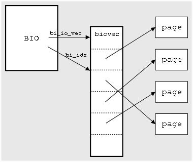

# 通过hijack了解bio
## 背景
bio是block io,它是一个描述硬盘里面的位置与page cache的页对应关系的数据结构，每个bio对应的
硬盘里面一块连续的位置，每一块硬盘里面连续的位置，可能对应着page cache的多页，或者一页，
所以它里面会有一个`bio_vec *bi_io_vec`的表。
而每个bio_vec都只能描述一个页内数据的连续的数据的偏移和长度:



通过bi_sectors和bi_size来描述硬盘中起始位置和长度。
一个bio的处理:一个bio通常通过`submit_bio`来提交给设备队列，下面会经过bio聚合，转化成request,磁盘调度队列，块设备驱动，磁盘处理，对于bio来说大部分都是异步，所以处理结束通过`bio->bi_end_io`来作为callback获取结果,外部的接口使用bio_endio。同步的读写是通过等待callback事件到来从而完成同步读写。  
>中间贴的只是代码片段，介绍怎么做的，不能直接运行的。获取全部的代码片段，请联系我
## 目标
进行块设备加密，磁盘落盘的数据是密文，而对于文件系统来说是明文.加密算法因为用过sm4，所以就选用了最简单的`sm4(ecb)`加解密。
### 设计
submit_bio是写IO的起手势,所以通过hook submit_bio来进行写加密，保证提交给下面的数据是经过加密的就好了。而对于读IO可以通过在IO完成之后通知给文件系统之前进行解密，可以hook bio_endio来进行数据解密，确保page cache上的数据是经过解密后的明文。
### 写加密
bio只是管理的数据结构，数据仍然是存放在page cache中的，最终的结果要求是page cache中的所述句仍然是明文，提交给磁盘的数据是密文，所以一块数据是搞不定这件事了，我们需要重新申请一块内存来存放密文数据。
```
long origin_submit_bio(int rw, struct bio *bio);
void hook_submit_bio(int rw, struct bio *bio)
{
    ret = try_crypt_bio(rw, bio);
    if (ret != 0) {
        origin_submit_bio(rw, bio);
    }
    return;
}
int bfx_bio_alloc_pages(struct bio *bio, gfp_t gfp)
{
    int i;
    struct bio_vec *bv;

    bio_for_each_segment(bv, bio, i) {
        bv->bv_page = alloc_page(gfp);
        if (!bv->bv_page) {
            while (bv-- != bio->bi_io_vec + bio->bi_idx)
                __free_page(bv->bv_page);
            return -ENOMEM;
        }
    }

    return 0;
}

void bfx_crypt_callback(struct bio *bio, int error)
{
    unsigned int i;
    struct bio_vec *bv;
    struct bio *origin = (struct bio *)bio->bi_private;

    bio_for_each_segment_all(bv, bio, i) {
        BUG_ON(!bv->bv_page);
        __free_page(bv->bv_page);
        bv->bv_page = NULL;
    }

    bio_endio(origin, error);

    bio_put(bio);
}
struct bio* bfx_bio_clone(struct bio *origin)
{
    struct bio *new = NULL;
    new = bio_clone(origin, GFP_NOIO);
    if (!new)
        return NULL;

    if (bfx_bio_alloc_pages(new, GFP_NOIO)) {
        bio_put(new);
        return NULL;
    }

    new->bi_private = origin;
    new->bi_end_io = bfx_crypt_callback;
    return new;
}
int try_crypt_bio(int rw, struct bio *bio)
{
    sm4_key_t key;
    int i, j;                                                                                                                                  
    char buffer[SM4_BLOCK_SIZE * 2 + 1];
    struct bio_vec *bv;
    struct bio *new;

    if (!(rw & WRITE)) {
        return -1;
    }

    new = bfx_bio_clone(bio);
    if (!new) {
        BUG();
        return -ENOMEM;
    }
    new->bi_rw |= rw;
    bio->bi_rw |= rw;

    sm4_set_key1(&key, mykey, 16);

    bio_for_each_segment(bv, bio, i) {
        void *p1 = kmap(bv->bv_page);
        void *p2 = kmap(new->bi_io_vec[i].bv_page);
        /* Encrypt your bio data */
        /*
        for (j = bv->bv_offset; j < bv->bv_offset + bv->bv_len; j+= SM4_BLOCK_SIZE) {
            sm4_do_crypt(key.rkey_enc, (u32 *)(p2 + j), (u32 *)(p1 + j));
        }
        */

        kunmap(bv->bv_page);
        kunmap(new->bi_io_vec[i].bv_page);
    }

    generic_make_request(new);
    return 0;
}
```
### 读解密
相对于写操作，读IO就比较简单了，从磁盘中读取到了密文数据到page cache中，我们只需要在文件系统看到这块page cache前解密就好，不需要倒腾内存，只需要原地解密。

遍历bio指向的内存数据:
```
void origin_bio_endio(struct bio *bio, int error);
void hook_bio_endio(struct bio *bio, int error)
{
    try_decrypt_bio(bio, error);

    origin_bio_endio(bio, error);                                                                                                           
    return;
}
void try_decrypt_bio(struct bio *bio, int error)
{
    sm4_key_t key;
    int i, j;
    char buffer[SM4_BLOCK_SIZE];
    char *ptr = NULL;
    unsigned long flags;
    struct bio_vec *bv;

    if (bio_data_dir(bio) == WRITE)
        return;

    sm4_set_key1(&key, mykey, 16);

    bio_for_each_segment(bv, bio, i) {
        ptr = bvec_kmap_irq(bv, &flags);
        for (j = 0; j < bv->bv_len; j+= SM4_BLOCK_SIZE) {
            /* Decrypt ptr pointer buffer */
            /*
            sm4_do_crypt(key.rkey_dec, (u32 *)buffer, (u32 *)(ptr + j));
            memcpy(ptr + j, buffer, SM4_BLOCK_SIZE);
            */
        }
        bvec_kunmap_irq(ptr, &flags);
    }   
}
```
### 后续改进
因为加解密完全使用cpu来进行，速度肯定比较慢，最终的结果就是IO速率大幅度下降.

一个选择就是使用有硬件加密卡支持的算法，提升速率;

另外一个选择就是启动一个线程，先将bio缓存下来慢慢加解密，为了提升体验，可以提升读IO的优先级，让用户优先看到数据，至于写放在后台慢慢整吧。

## 参考
>https://lwn.net/Articles/26404/  
>www.eeworld.com.cn/mp/ymc/a52704.jspx  
>drivers/md/dm-crypt.c
