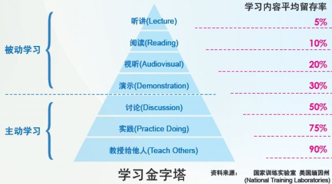

面试的时候，我会问面试者，你日常如何构建自己的知识体系，如何让自己更高更快更强？多数工程师并没有深入地思考过这个问题，基本上是零敲碎打，随机性大。
本着不能让你白来一趟的精神，好为人师的我会娓娓道来：

## 第一阶段 认真构建完整的知识体系  
十几年前我投身软件行业的时候，光是讲解数据库原理、操作系统、TCP/IP、组网、算法等等基础知识的英文原版书摞起来就等身，认认真真看完，各种上手实践，入行后，读遍 C++ 各种经典著作，读遍各种协议原文，认认真真打基础。  
很多工程师都说自己平常就是在某些 IT 门户上看看推荐的博文或新闻，我说这属于典型的零敲碎打，不够刺激。  
聊到这时，我会举一个例子，为什么要阅读长篇小说，因为中短篇小说就像用针扎你，而长篇小说就像把你装进一个沙袋里吊起来，从四面八方用狼牙棒打你，酣畅淋漓。构建可用的知识体系，就得读书，书是有体系结构的，你关心不关心，现阶段你用到用不到，它都讲到了，从头到尾看几遍，针扎得透透的。  

何谓知识体系？  
几年前，前支付宝架构师姚建东曾经在我们公司做过技术人员如何规划自己的分享讲座，他是这么论述的：  
技术与技巧包括：

    计算机基础理论
        计算机模型：内存/IO/时钟/CPU……
        算法
        专项技术领域：
            数据挖掘
            数据管理
            智能推荐
            搜索
            ……
    语言与工具
        语言与相关体系
        开发工具，分析工具，代码管理工具
        HTML/CSS/JS/Ajax
        常用框架与第三方类库
    调试与测试
        调试方法和哲学
        定位问题
        BUG管理工具
        单元测试
        集成测试
        性能测试
        安全测试
        兼容性测试与方法
        JS/Ajax测试与方法
        服务层测试
        Web层测试
    网络与系统
        TCP/IP协议与模型，HTTP/SMTP等协议
        Linux系统，网络分析工具，系统分析工具
        容量，流量与负载均衡
        应用部署、规范、规划
        安全
        监控与故障分析
        磁盘与存储
        Shell
        DNS与域名
        缓存，反向代理
        图片服务器（海量小文件）
    需求挖掘与分析
        需求文档格式
        需求访谈
        需求分析方法，需求分析工具
        领域知识与经验
    系统分析与设计
        UML语言与模型
        分析模式
        设计模式，领域驱动
        系统分析文档格式
        系统设计文档格式
        功能性需求与非功能性需求
    数据与系统
        数据库
        可伸缩策略，扩展策略，备份，容灾，性能，安全，高可用……
        数据设计与范式，SQL/NoSQL，Cache，分布式文件
    架构设计
        架构模式，典型互联网公司架构演进历史
        架构原则，常用策略
        架构设计方法
        非功能性理解
            扩展性
            伸缩性
            稳定性
            一致性
            性能
            吞吐量
        容量预测与规划
        架构体系与相关技术
    过程与管理
        分析过程
        研发过程
        评审过程
        测试过程
        发布过程
        回滚过程
        文档管理
        知识管理
        项目管理

以上其实就是一份从业基础知识清单，你可以按图索骥，阅读相关书籍。

第二阶段 顺着一个Topic钻进去，锻炼自己的预研能力  
无论公司业务还是自己喜欢做的事，都可以抽象出通用性课题，然后以做论文的方式杀进去。这个事情得反复操练，有意识操练。  
做事方式为：

    抽象出 Topic——如分布式锁，分布式并行计算引擎，防CSRF的FormToken自动生成框架，定时任务管理与调度平台，分布式跟踪，等等  
    向功课好的学生学习——有针对性地深入了解业界其他公司是如何分析问题和解决问题的，汇总各种方案，站在巨人的肩膀上  
    分析特定应用场景，技术选型  
    兼顾高可用性和可伸缩，做设计评审  
    做测试自证靠谱，梳理知识点，开技术分享会  
    上线商用，总结经验教训，开经验分享会  

其中一个重点是汇总和分享。05年时，应电信级统一消息业务需要，我去研究了 SIP 协议，做了各种试验，分析报文，写了一系列的幻灯片，做了公开分享，一时间还颇受欢迎：

    SIP_to_Freshman_by_zhengyun.ppt
    SIP之穿越NAT_by_zhengyun.ppt
    SIP体系架构讲义及消息交互演示_by_zhengyun.ppt
    SIP多方会话消息之实例讲解_by_zhengyun.ppt
    SIP安全框架之认证[NTLM和Kerberos]_by_zhengyun.ppt
    SIP消息之逐项讲解_by_zhengyun.ppt

为什么要写出来、讲出来呢？  
因为有一个学习金字塔理论，如下图所示：
  
学习金字塔  
我们读过的事情能够记住学习内容的10%，  
我们听过的事情能够记住20%，  
我们看过的事情能够记住30%，  
我们听过和看过的事情能够记住50%——如看影像/看展览/看演示/现场观摩，  
我们说过的事情能够记住70%——如参与讨论/发言，  
我们说过和做过的事情能够记住90%——如做报告，给别人讲，亲身体验，动手做。  
这也就是我在《窝窝研发过去几年做对了哪些事》中阐述的管理方法：我们从入职之后就有意识地训练大家，让大家能够公开陈述、清晰表达。所以，试用期内，新人必须做一次技术分享和一次技术评审，面对各方的 challenge；预研的中间和结尾都要有分享会；平时也要定期组织技术讲座。  

第三阶段 疯狂回答技术问题  
知识体系慢慢构建，与业务相关的抽象 Topic 也在探索中。  
但这还不够。  
因为你亲身接触到的世界太小，可能不足以构成挑战，你可能意识不到自己缺多少知识和技能，不利于你分析问题、提出问题和解决问题的能力培养。  
所以，要主动出击：
疯狂回答问题。  

我曾经在入行的头几年里几乎把我关注的垂直领域（包括语言领域和业务领域）里的所有问题都回答了一遍。我对外宣扬知无不言言无不尽，放出邮件地址和 MSN（那时候 MSN 很高大上），很多网友都会发邮件或者加我好友，问各种开发疑难问题，平均每天都有几个，然后我把解决问题的过程写成微软 KB（KnowledgeBase） 文体发表在我的博客上。  
你想想看，工作中的问题你平均每隔几天才能遇到一个，而这么做，每天你都会遇到几个乃至于十几个，第一让你脑力激荡，第二接触到更多新知。  

05年到06年期间，我因工作需要学习了 JavaME（或古老的称呼 J2ME），早年间 Symbian 手机上的客户端开发。那段时间我天天扫中文论坛的帖子，力求回答所有问题，尤其是那些 BUG 或故障。对于那些暂时没有人解决的，如流媒体实时播放，如仿 OperaMini 二级菜单界面，都上下求索，最后放出思路以及源码。  
同时，我经常整理常见问题，梳理成册并发布。譬如我整理过的 J2ME 疑难问题：  

    [J2ME Q&A]真机报告MontyThread -n的错误之解释
    [J2MEQ&A]WTK初始化WMAClient报错XXX has no IP address的解释
    [J2ME Q&A]untrusted domain is not configured问题回应
    [J2ME]“Cannot open socket for LIME events”错误解决

几个月后，我成为 J2ME 中文论坛超级版主。通过这个历程，我想告诉大家，回答网友问题，技巧得当的话，比如别老是重复回答新手问题，试着攻克那些疑难问题，或者离奇故障，绝对不会浪费你的时间。  
为什么？  
因为你要信奉：  

    你学过的每一样东西，你遭受的每一次苦难，都会在你一生中的某个时候派上用场。
    ——佩内洛普·菲兹杰拉德 《离岸》

    Everything that you've learnt and all the hardships you've suffered will all come in handy at some point in your life.

第四阶段 RCA/总结  
现在是你把经验教训变为财富的时刻了。  
什么是好的技术 Leader？  
随便一个业务需求或业务场景讲出来，你立刻把它抽象为几个模块/系统/Topic，然后侃侃而谈，业界都是怎么解决的，我们以前又是怎么分析怎么解决的，现在咱们这种情况下应该如何设计，可能会遇到什么问题，我们应该做哪些预防设计，blabla。  

怎么做到这一点？  
第一，写 RCA 报告。  
我以前说过，『窝窝从 2011 年开始，一直坚持每错必查、错了又错就整改、每错必写，用身体力行告诉每一个新员工直面错误、公开技术细节、分享给所有人，长此以往，每一次事故和线上漏测都会变为我们的财富。这就是我们的 RCA（Root Cause Analysis）制度，截止到目前已经收集整理了近两百个详尽的 RCA 报告。』
RCA 报告格式为：  

    背景知识（Optional）
    问题现象
    影响范围
    问题原因
    问题分析过程（Optional）
    解决办法
    后续处理措施：如线上脏数据如何修复，如对用户造成的影响如何弥补等（Optional）
    经验教训
    RCA类型：如代码问题、实施问题、配置问题、设计问题、测试问题

这样，作为一名合格的老兵，你见过了足够多的血，并且把它们变成了你的人生财富。  
第二，写总结。  
话说，要经常拉清单。  
侃侃而谈得有资料，这些都得是你自己写才能印象深刻，关键时刻想得起来。

好了，这就是我告诉面试者的高手炼成四个阶段。  
